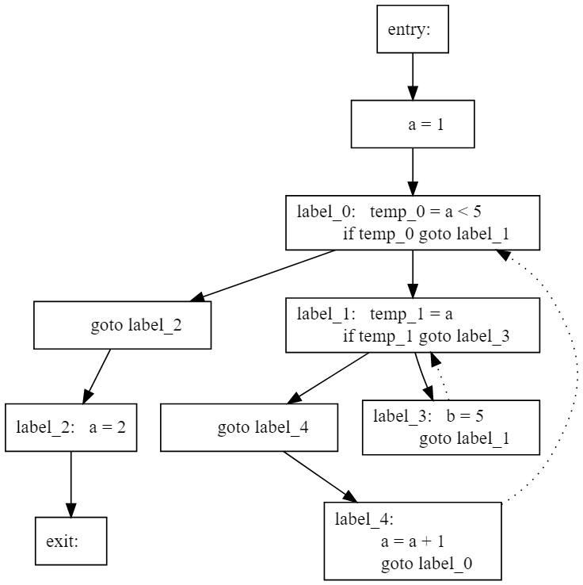

# Содержание

* [Введение](#введение)
* [Структура проекта](#структура-проекта)
* [Оптимизация операции умножения на единицу](#оптимизация-операции-умножения-на-единицу)
* [Оптимизация операции умножения на ноль](#оптимизация-операции-умножения-на-ноль)
* [Оптимизация перемножения констант](#оптимизация-перемножения-констант)
* [Оптимизация суммирования с нулем](#оптимизация-суммирования-с-нулем)
* [Оптимизация вычитания собственного значения](#оптимизация-вычитания-собственного-значения)
* [Оптимизация операции меньше](#оптимизация-операции-меньше)
* [Оптимизация операции сравнения равно](#оптимизация-операции-сравнения-равно)
* [Оптимизация операций сравнения с собой](#оптимизация-операций-сравнения-с-собой)
* [Оптимизация операций больше, не равно](#оптимизация-операций-больше,-не-равно)
* [Оптимизация присваивания собственного значения](#оптимизация-присваивания-собственного-значения)
* [Оптимизация if true](#оптимизация-if-true)
* [Оптимизация if false](#оптимизация-if-false)
* [Оптимизация if ex null else null](#оптимизация-if-ex-null-else-null)
* [Оптимизация while false](#оптимизация-while-false)
* [Удаление всех null](#удаление-всех-null)
* [Оптимизация вложенных блоков](#оптимизация-вложенных-блоков)
* [Генерация трехадресного кода](#генерация-трехадресного-кода)
* [Логические тождества](#логические-тождества)
* [Свертка констант, протяжка констант, оптимизация алгебраических тождеств внутри базового блока](#свертка-констант,-протяжка-констант,-оптимизация-алгебраических-тождеств-внутри-базового-блока)
  * [Свертка констант](#свертка-констант)
  * [Протяжка констант ](#протяжка-констант)
  * [Оптимизация алгебраических тождеств](#оптимизация-алгебраических-тождеств)
* [Выделение Базовых Блоков](#выделение-базовых-блоков)
* [Удаление мертвых переменных](#удаление-мертвых-переменных)
* [Вычисление Def-Use удаление мертвого кода протяжка констант](#вычисление-def-use-удаление-мертвого-кода-протяжка-констант)
* [Оптимизация общих подвыражений и протяжка копий](#оптимизация-общих-подвыражений-и-протяжка-копий)
  * [Оптимизация общих подвыражений](#оптимизация-общих-подвыражений)
  * [Протяжка копий](#протяжка-копий)
* [Очистка от пустых операторов и устранение переходов через переходы](#очистка-от-пустых-операторов-и-устранение-переходов-через-переходы)
* [Устранение недостижимого кода и устранение переходов к переходам](#устранение-недостижимого-кода-и-устранение-переходов-к-переходам)
  * [Устранение недостижимого кода](#устранение-недостижимого-кода)
  * [Устранение переходов к переходам](#устранение-переходов-к-переходам)
* [Удаление мертвого кода и протяжка копий](#удаление-мертвого-кода-и-протяжка-копий)
  * [Протяжка копий](#протяжка-копий)
  * [Удаление мертвого кода](#удаление-мертвого-кода)
* [Построение Графа Потока Управления](#построение-графа-потока-управления)
* [Алгоритм LVN](#алгоритм-lvn)
* [Устранение локальных общих подвыражений построением ациклического графа](#устранение-локальных-общих-подвыражений-построением-ациклического-графа)
* [Хранение IN B и OUT B для ряда задач](#хранение-in-b-и-out-b-для-ряда-задач)
* [Достигающие определения множества genB killB Передаточная функция базового блока В](#достигающие-определения-множества-genb-killb-передаточная-функция-базового-блока-в)
* [Для достигающих определений вычислить genB killB для любого B](#для-достигающих-определений-вычислить-genb-killb-для-любого-b)
* [Итерационный алгоритм для достигающих определений](#итерационный-алгоритм-для-достигающих-определений)
* [Оптимизация Распространение констант](#оптимизация-распространение-констант)
* [Итерационный алгоритм для активных переменных](#итерационный-алгоритм-для-активных-переменных)
* [Вычисление множеств DEFb и USEb для активных переменных](#вычисление-множеств-defb-и-useb-для-активных-переменных)
* [Итерационный алгоритм для доступных выражений](#итерационный-алгоритм-для-доступных-выражений)
* [Удаление мертвых переменных на основе итерационного алгоритма](#удаление-мертвых-переменных-на-основе-итерационного-алгоритма)
* [Передаточная функция в задаче о распространении констант](#передаточная-функция-в-задаче-о-распространении-констант)
* [Класс передаточной функции](#класс-передаточной-функции)
* [Доступные выражения-множества e_genB и e_killB Передаточная функция базового блока В](#доступные-выражения-множества-e_genb-и-e_killb-передаточная-функция-базового-блока-в)
* [Оптимизация Доступные выражения](#оптимизация-доступные-выражения)
* [Генерация CIL-кода по трехадресному программному коду](#генерация-cil-кода-по-трехадресному-программному-коду)
* [Класс обобщенного итерационного  алгоритма](#класс-обобщенного-итерационного--алгоритма)
* [Поиск доминаторов для каждой вершины графа потока управления](#поиск-доминаторов-для-каждой-вершины-графа-потока-управления)
* [Получение трехадресного кода из графа потока управления](#получение-трехадресного-кода-из-графа-потока-управления)
* [Определение того, является ли ребро обратным и являеется ли CFG приводимым](#определение-того,-является-ли-ребро-обратным-и-являеется-ли-cfg-приводимым)
  * [Является ли ребро обратным](#является-ли-ребро-обратным)
  * [Является ли CFG приводимым](#является-ли-cfg-приводимым)
* [Определение глубины CFG](#определение-глубины-cfg)
* [Классификация ребер в графе потока управления данных и построение глубинного остовного дерева](#классификация-ребер-в-графе-потока-управления-данных-и-построение-глубинного-остовного-дерева)
* [Определение всех естественных циклов в CFG с информацией об их вложенности](#определение-всех-естественных-циклов-в-cfg-с-информацией-об-их-вложенности)
* [Тестирующая система](#тестирующая-система)
* [Заключение](#заключение)


# Документация проекта onlyReal

# Введение
В этом проекте перед командами стояла задача разработать грамматику языка и создать дял неё оптимизирующий компилятор.

Проект реализован на языке с#. Также были использованы генератор синтаксического анализатора Yacc и генератор лексического анализатора Lex.

# Структура проекта
<table>
    <thead>
    <tr>
        <th>Раздел</th>
        <th>Задача</th>
        <th>Название команды</th>
    </tr>
    </thead>
    <tbody>
    <tr>
        <td>AST дерево</td>
        <td></td>
        <td></td>
    </tr>
    <tr>
        <td>1</td>
        <td>Оптимизация операции умножения на единицу</td>
        <td>Roll</td>
    </tr>
    <tr>
        <td>2</td>
        <td>Оптимизация операции умножения на ноль</td>
        <td>Roslyn</td>
    </tr>
    <tr>
        <td>3</td>
        <td>Оптимизация перемножения констант</td>
        <td>komanda</td>
    </tr>
    <tr>
        <td>4</td>
        <td>Оптимизация суммирования с нулем</td>
        <td>SouthPark</td>
    </tr>
    <tr>
        <td>5</td>
        <td>Оптимизация вычитания собственного значения</td>
        <td>Nvidia</td>
    </tr>
    <tr>
        <td>6</td>
        <td>Оптимизация операции сравнения <</td>
        <td>GreatBean</td>
    </tr>
    <tr>
        <td>7</td>
        <td>Оптимизация операции сравнения ==</td>
        <td>Intel</td>
    </tr>
    <tr>
        <td>8</td>
        <td>Оптимизация операций сравнения с собой</td>
        <td>qwerty</td>
    </tr>
    <tr>
        <td>9</td>
        <td>Оптимизация операций >, !=</td>
        <td></td>
    </tr>
    <tr>
        <td>10</td>
        <td>Оптимизация присваивания собственного значения</td>
        <td>Nvidia, BOOM</td>
    </tr>
    <tr>
        <td>11</td>
        <td>Оптимизация if (true)</td>
        <td>Roslyn</td>
    </tr>
    <tr>
        <td>12</td>
        <td>Оптимизация if (false)</td>
        <td>GreatBean, komanda, Intel</td>
    </tr>
    <tr>
        <td>13</td>
        <td>Оптимизация if (ex) null else null</td>
        <td>qwerty</td>
    </tr>
    <tr>
        <td>14</td>
        <td>Оптимизация while (false)</td>
        <td>Roll</td>
    </tr>
    <tr>
        <td>15</td>
        <td>Удаление всех null</td>
        <td>BOOM</td>
    </tr>
    <tr>
        <td>16</td>
        <td>Оптимизация вложенных блоков</td>
        <td>SouthPark</td>
    </tr>
    <tr>
        <td>Трехадресный код</td>
        <td></td>
        <td></td>
    </tr>
    <tr>
        <td>1</td>
        <td>Генерация трехадресного кода</td>
        <td>Roslyn</td>
    </tr>
    <tr>
        <td>2</td>
        <td>Логические тождества < > and or true false</td>
        <td>GreatBean</td>
    </tr>
    <tr>
        <td>3</td>
        <td>Свертка const, алгебраические тождества (в т.ч. каскадные) + протяжка const</td>
        <td>Roslyn</td>
    </tr>
    <tr>
        <td>4</td>
        <td>Выделение ББл</td>
        <td>Nvidia</td>
    </tr>
    <tr>
        <td>5</td>
        <td>Живые и мёртвые переменные внутри ББл - анализ удаления мертвого кода (в т.ч. каскадное)</td>
        <td>Roll</td>
    </tr>
    <tr>
        <td>6</td>
        <td>Вычисление Def-Use: Удаление мертвого кода, протяжка const (каскадная)</td>
        <td>komanda</td>
    </tr>
    <tr>
        <td>7</td>
        <td>Оптимизация общих подвыражений (простейшая) + протяжка копий</td>
        <td>qwerty</td>
    </tr>
    <tr>
        <td>8</td>
        <td>Очистка от пустых операторов устранение переходов через переходы</td>
        <td>SouthPark</td>
    </tr>
    <tr>
        <td>9</td>
        <td>Устранение недостижимого кода. Устранение переходов к переходам</td>
        <td>BOOM</td>
    </tr>
    <tr>
        <td>10</td>
        <td>Удаление мертвого кода, протяжка копий</td>
        <td>Intel</td>
    </tr>
    <tr>
        <td>11</td>
        <td>CFG</td>
        <td>Nvidia</td>
    </tr>
    <tr>
        <td>12</td>
        <td>Алгоритм LVN</td>
        <td>Roll</td>
    </tr>
    <tr>
        <td>13</td>
        <td>Устранение локальных общих подвыражений построением ациклического графа</td>
        <td>qwerty</td>
    </tr>
    <tr>
            <td>14</td>
            <td>Хранение IN[B] и OUT[B] для ряда задач</td>
            <td>SouthPark</td>
        </tr>
    <tr>
        <td>15</td>
        <td>Для достигающих определений вычислить genB, killB для любого B и разработать структуру для хранения передаточной функции.
            fB = fSn*fSn-1*...*fS1 - вычислить fSi для каждой инструкции ББл и потом найти композицию</td>
        <td>Roslyn</td>
    </tr>
    <tr>
        <td>16</td>
        <td>Для достигающих определений вычислить genB, killB для любого B и разработать структуру для хранения передаточной функции.
            Вычислить fB по яв. формулам fB(x)=genB U (x - killB) killB = kill1 U kill2 U ... U killn, gebB = ....</td>
        <td>Intel</td>
    </tr>
    <tr>
        <td>17</td>
        <td>Итерационный Алгоритм для достигающих определений</td>
        <td>Nvidia</td>
    </tr>
    <tr>
        <td>18</td>
        <td>Оптимизация на основе ИтА для активных переменных - удаление мертвого кода </td>
        <td>Roll</td>
    </tr>
    <tr>
        <td>19</td>
        <td>Оптимизация протяжка const на основе инф., полученной в результате применения ИтА для достиг. определений</td>
        <td>Roslyn</td>
    </tr>
    <tr>
        <td>20</td>
        <td>Вычисление множеств DEFb и USEb д/активных переменных</td>
        <td>qwerty</td>
    </tr>
    <tr>
        <td>21</td>
        <td>Итерационный алгоритм для активных переменных</td>
        <td>BOOM</td>
    </tr>
    <tr>
        <td>22</td>
        <td>Итерационный алгоритм для доступных выражений</td>
        <td>GreatBean</td>
    </tr>
    <tr>
        <td>23</td>
        <td>Класс передаточной функции (общий):
            - ф-ии формулой
            - ф-ии алгоритмом
            - суперпозиция ф-ий</td>
        <td>Roll</td>
    </tr>
    <tr>
        <td>24</td>
        <td>Доступные выражения-множества e_genB, e-KILLb. Передаточная функция ББл В.</td>
        <td>SouthPark</td>
    </tr>
    <tr>
        <td>25</td>
        <td>На основе анализа доступных выражений провести оптимизации</td>
        <td>Roslyn</td>
    </tr>
    <tr>
        <td>26</td>
        <td>Генератор IL-кода</td>
        <td>Roslyn</td>
    </tr>
    <tr>
        <td>27</td>
        <td>Итерационный алгоритм в задаче растпространения констант</td>
        <td>Nvidia</td>
    </tr>
    <tr>
        <td>28</td>
        <td>Обобщенный итерационный алгоритм</td>
        <td>Roll</td>
    </tr>
    <tr>
        <td>29 - нет</td>
    </tr>
    <tr>
        <td>30 - нет</td>
        <td>Поиск решения методом MOP</td>
        <td>Intel</td>
    </tr>
    <tr>
        <td>31</td>
        <td>Передаточная функция в задаче о распространении констант</td>
        <td>Roslyn</td>
    </tr>
    <tr>
        <td>32</td>
        <td>Вычисление доминаторов</td>
        <td>komanda</td>
    </tr>
    <tr>
        <td>33</td>
        <td>ControlFlowGraph перевести в Трехадресный код</td>
        <td>BOOM</td>
    </tr>
    <tr>
        <td>34</td>
        <td>Определение того, является ли ребро обратным и являеется ли CFG приводимым</td>
        <td>GreatBean</td>
    </tr>
    <tr>
        <td>35</td>
        <td>Определение глубины CFG</td>
        <td>Roll</td>
    </tr>
    <tr>
        <td>36</td>
        <td>Классификация ребер в глубинном остовном дереве + Построение глубинного остовного дерева с соответствующей нумерацией вершин</td>
        <td>qwerty SouthPark</td>
    </tr>
    <tr>
        <td>37</td>
        <td>Определение всех естественных циклов в CFG с информацией об их вложенности</td>
        <td>Intel</td>
    </tr>
    </tbody>
</table>

# Оптимизация операции умножения на единицу

### Команда Roll

#### Постановка задачи
Выполнить замену выражений вида 1 \* ex, ex \* 1, ex / 1 на ex для AST.

#### Зависимости задач в графе задач

Задача зависит от:
* Построение AST

#### Теория
Оптимизации на AST являются достаточно простыми и в то же время важными, так как позволяют убирать целые блоки кода или выражения еще до генерации кода. Данный тип оптимизаций выполняется с помощью шаблона проектирования Visitor, который позволяет изменять однотипные сущности. В нашем случае это узлы AST. Очевидно, что выражения 1 \* ex, ex \* 1, ex / 1 следует заменить на ex.

#### Особенности реализации
Для использования данной оптимизации необходимо:
1. Подключить пространство имен SimpleLang.Visitors;
2. Построить AST
3. Проставить ссылки на родителей для каждого узла
4. Создать визитор OptMulDivOneVisitor и применить его к AST

Ниже представлен код использования данной оптимизации:
```csharp
// синтаксическое дерево уже построено
	var r = parser.root;	// корень AST
	r.Visit(new FillParentVisitor());	// установка ссылок на родителей на AST
	r.Visit(new OptMulDivOneVisitor());	// выполнение текущей оптимизации
```
Далее AST используется для генерации трехадресного, а затем IL кода.

#### Тесты
```
Исходный код до оптимизации:
{
    int a,b;
    a = 1;
    while (false)
    {
        while ((((a * 1) + (b / 1)) + (1 * a)))
        {

        }
    }
    a = 2;
}
После оптимизации:
{
    int a,b;
    a = 1;

    a = 2;
}
```

[Вверх](#содержание)
# Оптимизация операции умножения на ноль

### Команда Roslyn

#### Постановка задачи
Требуется найти в AST-дереве выражения, в которых происходит умножение некоторого подвыражения на константное число 0 и произвести замену всего выражения на число 0.

#### Зависимости задач в графе задач
Задача зависит от:
* генерация AST-дерева;
* заполнение связей типа "предок-потомок".

#### Теория
В исходном коде программы в некоторых случаях можно встретить явное умножение алгебраического выражения на число 0. В данному случае можно произвести оптимизацию кода на этапе компиляции, заменив все подвыражение на константное значение 0. К случаям, когда можно применить оптимизацию, можно отнести следующие:
* *b\*0*
* *0\*b*

Подобные выражения можно оптимизировать, если при компиляции исходного кода программы заменить данное выражение на число 0. Подобная оптимизация позволит сделать вычисление программы более быстрым, поскольку потребуется меньше памяти для вычисления программы, поскольку некоторые переменные перестанут быть необходимыми, и операций работы с оперативной памятью.

#### Особенности реализации
При использовании программного кода, позволяющего произвести оптимизацию выражений, внутри которых происходит умножение на 0, требуется произвести построение AST-дерева для исходного кода программы, написанном на реализованном языке программирования, и выделить для построенного дерева связи типа "предок-потомок". К полученному дереву следует применить визитор SimpleLang.Visitors.Opt2Visitor. Таким образом, последовательность действий для использования данной оптимизации будет следующей:
1) сгенерировать AST-дерево;
2) с помощью визитора SimpleLang.Visitors.FillParentVisitor заполнить связи между узлами дерева типа "предок-потомок";
3) создать объект типа SimpleLang.Visitors.Opt2Visitor;
4) для полученного дерева вызвать функцию Visit с объектом Opt2Visitor, созданном на 3-ем этапе, поданным как аргумент функции.
```csharp
using SimpleLang.Visitors;
...
FillParentVisitor pvisit = new FillParentVisitor();
tree.Visit(pvisit);
Opt2Visitor zvisit = new Opt2Visitor();
tree.Visit(zvisit);
```
В данном коде подразумевается, что переменная *tree* содержит в себе AST-дерево программы.


#### Тесты
Для исходного кода 
```csharp
{
	int b;
	b = b * (1+2+3+123+321) * (654/332*0) + 123;
}
```

После использования оптимизации умножения на 0 в AST-дереве получается следующий код:
```csharp
{
	int b;
	b = b * (1+2+3+123+321) * (0) + 123;
}
```
Если использовать данную оптимизацию каскадно, то можно получить следующий код:
```csharp
{
	int b;
	b = 0 + 123;
}
```

[Вверх](#содержание)

# Оптимизация перемножения констант

### Команда Komanda

#### Постановка задачи
Задача состояла в замене умножения констант на их произведение

#### Зависимости в графе задач
Данная задача не зависит от других задач в графе задач и не порождает новых зависимостей

#### Теория
Очевидно, что замена выражения вида const*const на значение этого произведения является эквивалентным преобразованием

#### Особенности реализации
```csharp
    namespace SimpleLang.Visitors
    {
        class MultiplicationComputeVisitor : ChangeVisitor
        {
            public override void VisitBinOpNode(BinOpNode binop)
            {
                if (binop.Left is ExprNode el)
                    el.Visit(this);
                if (binop.Right is ExprNode er)
                    er.Visit(this);
                if (binop.Left is IntNumNode l && binop.Right is IntNumNode r && binop.Op == "*")
                    ReplaceExpr(binop, new IntNumNode(l.Num * r.Num));
                else
                    base.VisitBinOpNode(binop);
            }
        }
    }
```
Для каждого выражения вызываем визитор рекурсивно и при встрече умножения двух констант заменяем их на произведение

#### Тесты
исходный код:
```csharp
    int a;
    a = 2 * 3;
```
результат:
```csharp
    int a;
    a = 6;
```

[Вверх](#содержание)
# Оптимизация суммирования с нулем

### Команда South Park

#### Постановка задачи

Задача состояла в реализации оптимизации AST-дерева вида 0+expr

#### Зависимости задач в графе задач

Данная задача не зависит от других задач в графе задач и не порождает новых зависимостей.

#### Теория
При возникновении узла _BinOpNode_, один из аргументов которого является нулём, необходимо удалить ноль, а также осуществить обход дерева внутрь ненулевого выражения.

#### Особенности реализации

```csharp
    class PlusNonZero : AutoApplyVisitorInterface
    {
        public override void VisitBinOpNode(BinOpNode binop)
        {
            if (binop.Left is IntNumNode && (binop.Left as IntNumNode).Num == 0 &&
            binop.Op[0] == '+')
            {
                binop.Right.Visit(this); 
                ReplaceExpr(binop, binop.Right); 
            }
            else
            {
                if (binop.Right is IntNumNode && (binop.Right as IntNumNode).Num == 0 &&
            binop.Op[0] == '+')
                {
                    binop.Left.Visit(this);
                    ReplaceExpr(binop, binop.Left);
                }
                else
                {
                    base.VisitBinOpNode(binop);
                }
                
            }
        }
    }
```
Класс _PlusNonZero_ является визитором и реализует интерфейс _AutoApplyVisitorInterface_. При посещении узла проверяется, является ли левый оператор целым нулевым числом, а операция-сложением. Если да, то происходит обход правого оператора и замена всего узла на правый оператор. Иначе происходит та же проверка на правый оператор. Если нужной ситуации не нашлось, продолжается обход дерева в обычном режиме.

#### Тесты
Пример входной программы:
```
{
    real b;
    int c;
    b=3.14+0;
    c = 0;
}
```
Пример программы после применения оптимизации:
```
{
    var b;
    var c;
    b = 3.14;
    c = 0;
}
```

[Вверх](#содержание)

# Оптимизация вычитания собственного значения

### Команда Nvidia

#### Постановка задачи
Требуется найти в AST-дереве выражения разности, оба операнда которых являются одной переменной на этапе компиляции и заменить их на константу `0`.

#### Зависимости задач в графе задач
Данная задача не зависит от других задач в графе задач и не порождает новых зависимостей.

#### Теория
В исходном коде программы возникают случаи, когда аргументы оператора разности равны. Такие операторы необходимо заменить на 0.

#### Особенности реализации
```
public class OptSimilarDifference : AutoApplyVisitorInterface
    {
        public override void VisitBinOpNode(BinOpNode binop)
        {
            if ((binop.Left is IdNode) && (binop.Right is IdNode) &&
                String.Equals((binop.Left as IdNode).Name, (binop.Right as IdNode).Name) &&
                (binop.Op == "-"))
            {
                ReplaceExpr(binop, new IntNumNode(0));
            }
            else
            {
                base.VisitBinOpNode(binop); // Обойти потомков обычным образом
            }
        }
        public override void VisitIfNode(IfNode ifn)
        {
            ifn.Cond.Visit(this);
        }
        public override void VisitWhileNode(WhileNode w)
        {
            w.Expr.Visit(this);
        }

        public override string ToString()
        {
            return "";
        }
    }
```
Был реализован класс `OptSimilarDifference`, который переопределяет процедуру `VisitBinOpNode`. Оптимизация происходит в случае, если оба операнда являются `IdNode`, их имена равны и бинарная операция - это разность.

#### Тесты
Программа до применения оптимизации:
```
```
Программа после применения оптимизации:
```
```

[Вверх](#содержание)
# Оптимизация операции меньше

### Команда GreatBean

#### Постановка задачи
Требуется найти в AST-дереве операторы сравнения, оба операнда которого являются числами на этапе компиляции и заменить их на логическое утверждение этих операторов.

#### Зависимости задач в графе задач
Задача зависит от:
* генерация AST-дерева;
* заполнение связей типа "предок-потомок".

#### Теория
В исходном коде программы зачастую появляются случаи, когда уже на этапе компиляции ясно, какие значения приняли те или иные перменные, являющиейся операндами в оператора сравнения. Преждевременая замена таких операторов на логические выражения, соответствующие смыслу этих опраторов может заметно ускорить программу на этапе выполнения.


#### Особенности реализации
При использовании программного кода, позволяющего произвести оптимизацию операторов сравнения, требуется произвести построение AST-дерева для исходного кода программы, написанном на реализованном языке программирования, и выделить для построенного дерева связи типа "предок-потомок".
К полученному дереву следует применить визитор SimpleLang.Visitors.LessOptVisitor. Таким образом, последовательность действий для использования данной оптимизации будет следующей:
1) сгенерировать AST-дерево;
2) с помощью визитора SimpleLang.Visitors.FillParentVisitor заполнить связи между узлами дерева типа "предок-потомок";
3) создать объект типа SimpleLang.Visitors.LessOptVisitor;
4) для полученного дерева вызвать функцию Visit с объектом LessOptVisitor, созданном на 3-ем этапе, поданным как аргумент функции.

Для решения этой задачи был реализован класс LessOptVisitor, который переопределяет класс VisitLogicOpNode. Стоит отметить, что перед заменой оператора сравнения на его логическое значение необходимо заранее обойти каждого из операндов для рекурсивной проверки их на возможность такой-же оптимизации.
Важно понимать, что оптимизации просиходит только в случае принадлежности обоих операндов численному типу.
```csharp
public class LessOptVisitor : ChangeVisitor
{
    public override void VisitLogicOpNode(LogicOpNode lop)
    {
        if (lop.Left is ExprNode)
            lop.Left.Visit(this); // Вначале сделать то же в левом поддереве

        if (lop.Right is ExprNode)
            lop.Right.Visit(this); // Затем в правом поддереве

        if (lop.Left is IntNumNode l && lop.Right is IntNumNode r
            && (lop.Operation == ">" || lop.Operation == "<"))
        {
            //Посчитаем сам знак
            bool nbool = lop.Operation == ">" ? l.Num > r.Num : l.Num < r.Num;
            //Проверим, что выражение не является условиев if
            if (lop.Parent is IfNode ifn)
                ifn.Cond = new BooleanNode(nbool);
            //Проверим, что выражение не является условиев while
            else if (lop.Parent is WhileNode w)
                w.Expr = new BooleanNode(nbool);
            else
                ReplaceExpr(lop, new BooleanNode(nbool));
        }
        else // Если оптимизаций нет, то
        {
            base.VisitLogicOpNode(lop); // Обойти потомков обычным образом
        }
    }

}
```


#### Тесты
Из исходной программы вида
```csharp
{
	bool w;
	w = (1 > 2) && (4 < 77);
}
```

Мы получаем
```csharp
{
    var w;
    w = (false && true);
}
```

[Вверх](#содержание)
# Оптимизация операции сравнения равно

### Команда Intel

#### Постановка задачи

Требуется найти в AST-дереве операторы сравнения, оба операнда которого являются числами на этапе компиляции и заменить их на логическое утверждение этих операторов.


#### Зависимости задач в графе задач

Данная задача не зависит от других задач в графе задач и не порождает новых зависимостей.


#### Теория

В исходном коде программы зачастую появляются случаи, когда уже на этапе компиляции ясно, какие значения приняли те или иные переменные, являющейся операндами в оператора сравнения. Преждевременная замена таких операторов на логические выражения, соответствующие смыслу этих операторов может заметно ускорить программу на этапе выполнения.


#### Особенности реализации

```
public override void VisitLogicOpNode (LogicOpNode lop) 
        {
            if (lop.Left is ExprNode)
                lop.Left.Visit(this); 

            if (lop.Right is ExprNode)
                lop.Right.Visit(this);

            if (lop.Left is IntNumNode l && lop.Right is IntNumNode r && (lop.Operation == "==")) {
                bool nbool = l.Num == r.Num;
                if (lop.Parent is IfNode ifn) {
                    ifn.Cond = new BooleanNode(nbool);
                    SetApply();
                } else
                    if (lop.Parent is WhileNode w) {
                    w.Expr = new BooleanNode(nbool);
                    SetApply();
                    } else
                        ReplaceExpr(lop, new BooleanNode(nbool));
            } else {
                base.VisitLogicOpNode(lop);
            }
        }

```

Была переопределена функция VisitLogicOpNode. Стоит отметить, что перед заменой оператора сравнения на его логическое значение необходимо заранее обойти каждого из операндов для рекурсивной проверки их на возможность такой-же оптимизации. Оптимизации происходит только в случае принадлежности обоих операндов численному типу.


#### Тесты

Программа до применения оптимизации:
```
{
	bool w;
	w = (1 == 2) && (4 == 4);
}
```

Программа после применения оптимизации:
```
{
    var w;
    w = (false && true);
}
```

[Вверх](#содержание)
# Оптимизация операций сравнения с собой
 
### Команда qwerty

#### Постановка задачи

Задача состояла в реализации оптимизации по AST-дереву выражений вида: ``` a==a``` и ``` a>=a```.

#### Зависимости задач в графе задач

Данная задача не зависит от других задач в графе задач и не порождает новых зависимостей.

#### Теория

Данная оптимизация заключается в том, чтобы заменять любое выражение вида ``` a==a``` или ``` a>=a``` на значение ```true```, так как эти выражения всегда дают истину.

#### Особенности реализации

```csharp
class OptVisitor_8 : ChangeVisitor2  
{  
    public override void VisitBinOpNode(BinOpNode binop)  
    {  
        if ((binop.Left is IdNode) && (binop.Right is IdNode) &&  
            (binop.Left as IdNode).Name == (binop.Right as IdNode).Name &&  
            (binop.Op == "==" || binop.Op == ">="))  
        {  
            if (binop.Parent is IfNode ifn)  
                ifn.Cond = new BooleanNode(true);  
            else if (binop.Parent is WhileNode w)  
                w.Expr = new BooleanNode(true);  
            else  
                ReplaceExpr2(binop, new BooleanNode(true));  
        }  
        else if ((binop.Left is ExprNode) && (binop.Right is ExprNode) &&  
                 (binop.Left.ToString() == binop.Right.ToString()) &&  
                 (binop.Op == "==" || binop.Op == ">="))  
        {  
            if (binop.Parent is IfNode ifn)  
                ifn.Cond = new BooleanNode(true);  
            else if (binop.Parent is WhileNode w)  
                w.Expr = new BooleanNode(true);  
            else  
                ReplaceExpr2(binop, new BooleanNode(true));  
        }  
        else    
            base.VisitBinOpNode(binop); // Обойти потомков обычным образом  
    }  

    public override void VisitIfNode(IfNode ifn)  
    {  
        ifn.Cond.Visit(this);  
    }  

    public override void VisitWhileNode(WhileNode w)  
    {  
        w.Expr.Visit(this);  
    }  
}
```
Класс _OptVisitor_8_ перегружает метод _VisitBinOpNode_, который при посещении узла AST-дерева, содержащего бинарное выражение типов: ```a==a``` или ```a>=a```, заменяет это выражение на        ```BooleanNode(true)```  с помощью метода _ReplaceExpr2_.

#### Тесты
Код до применения оптимизации:
```
if(a==a)
	x = x * 10;
```

Код после применения оптимизации:
```
if(true)
	x = x * 10;
```

[Вверх](#содержание)

# Оптимизация операций больше, не равно

### Команда Komanda

#### Постановка задачи
Задача состояла в замене логических выражений x != x, x > x на false

#### Зависимости в графе задач

Данная задача не зависит от других задач в графе задач и не порождает новых зависимостей

#### Теория

Логические выражения x != x и x > x равны false при любых значениях x, поэтому можно выполнять замену.

#### Особенности реализации

    using ProgramTree;
    using SimpleLang.Visitors;
    
    namespace SimpleLang.AstOptimisations
    {
        public class FalseExprMoreAndNonEqualVisitor : AutoApplyVisitorInterface
        {
            public override void VisitLogicOpNode(LogicOpNode lop)
            {
                if ((lop.Operation == ">" || lop.Operation == "!=") && lop.Right.ToString() == lop.Left.ToString())
                {
                    ReplaceExpr(lop, new BooleanNode(false));
                }
            }
        }
    }
    

Для всех логических операций проверяем, чтобы бинарная операция была = ">" или "!=" и левый и правый операнды были равны  

#### Тесты

исходный код:

    int a;
	bool b;
    b = a > a;
	b = a != a;

результат:

    int a;
    bool b;
    b = false;
    b = false;
    
[Вверх](#содержание)
# Оптимизация присваивания собственного значения

### Команда BOOM

#### Постановка задачи
Требуется заменить в AST-дереве присваивания вида a = a на null.

#### Зависимости задач в графе задач
Задача зависит от:
* генерация AST-дерева;
* заполнение связей типа "предок-потомок".

#### Теория
В исходном коде программы иногда можно встретить присваивания переменной самой себе. По сути после выполнения такого кода ничего не меняется, значит от такого кода можно и нужно избавляться. На этапе компиляции можно выявить такие дефекты и произвести оптимизацию.

#### Особенности реализации
При использовании программного кода, позволяющего произвести оптимизацию устранения выражений вида a = a, требуется произвести построение AST-дерева для исходного кода программы, написанном на реализованном языке программирования, и выделить для построенного дерева связи типа "предок-потомок". К полученному дереву следует применить визитор SimpleLang.Visitors.AssignVisitor. Таким образом, последовательность действий для использования данной оптимизации будет следующей:
1) сгенерировать AST-дерево;
2) с помощью визитора SimpleLang.Visitors.FillParentVisitor заполнить связи между узлами дерева типа "предок-потомок";
3) создать объект типа SimpleLang.Visitors.AssignVisitor;
4) для полученного дерева вызвать функцию Visit с объектом AssignVisitor, созданном на 3-ем этапе, поданным как аргумент функции.

Для решения этой задачи был реализован класс AssignVisitor, который переопределяет процедуру VisitAssignNode.
```csharp
class AssignVisitor: ChangeVisitor
    {
        public override void VisitAssignNode(AssignNode a)
        {
            if ((a.Expr is IdNode) && String.Equals(a.Id.Name, (a.Expr as IdNode).Name))
            {
                ReplaceStat(a, new NullNode());
            }
            else
            {
                base.VisitAssignNode(a);
            }
        }

        public override void VisitIfNode(IfNode ifn)
        {
            ifn.Cond.Visit(this);
        }
        public override void VisitWhileNode(WhileNode w)
        {
            w.Expr.Visit(this);
        }

        public override string ToString()
        {
            return "";
        }
    }
```


#### Тесты
Из исходной программы вида
```csharp
{
    int a, b;
    int c, d;
    a = 3;
    b = a + 3;
    c = b + a + 2;
    d = c + b;
    c = c;
    b = a + 2;
    d = d;
    a = b + 1;
}

```

Мы получаем
```csharp
{
    int a, b;
    int c, d;
    a = 3;
    b = a + 3;
    c = b + a + 2;
    d = c + b;
    #NULL;
    b = a + 2;
    #NULL;
    a = b + 1;
}

```

[Вверх](#содержание)
# Оптимизация if true

### Команда Roslyn

#### Постановка задачи
Требуется найти в AST-дереве условные операторы, в условии которых используется константное значение, принимающее истинное значение, и произвести замену всего условного оператора в AST-дереве на операторы из ветки true данного оператора.

#### Зависимости задач в графе задач
Задача зависит от:
* генерация AST-дерева;
* заполнение связей типа "предок-потомок".

#### Теория
В исходном коде программы в некоторых случаях можно встретить условный оператор, в котором в явном виде в условии указано константа true. В данному случае можно произвести оптимизацию кода на этапе компиляции, заменив весь условный оператор на операторы из его ветки по условию истинности. К случаям, когда можно применить оптимизацию, можно отнести следующие:
* *if ( true ) { OperatorTrue; } else { OperatorElse; }*

Подобные условные операторы можно оптимизировать на этапе компиляции, заменив весь код данного условного оператора на операторы ветки true. В данном примере это *{ OperatorTrue; }*. Данная оптимизация позволит избавить код программы от лишних вычислений условного оператора, а также от ненужных операторов перехода, которые могут замедлить выполнение скомпилированной программы.

#### Особенности реализации
При использовании программного кода, позволяющего произвести оптимизацию условного оператора, принимающего в качестве условия истинную константу, требуется произвести построение AST-дерева для исходного кода программы, написанном на реализованном языке программирования, и выделить для построенного дерева связи типа "предок-потомок". К полученному дереву следует применить визитор SimpleLang.Visitors.Opt11Visitor. Таким образом, последовательность действий для использования данной оптимизации будет следующей:
1) сгенерировать AST-дерево;
2) с помощью визитора SimpleLang.Visitors.FillParentVisitor заполнить связи между узлами дерева типа "предок-потомок";
3) создать объект типа SimpleLang.Visitors.Opt11Visitor;
4) для полученного дерева вызвать функцию Visit с объектом Opt11Visitor, созданном на 3-ем этапе, поданным как аргумент функции.
```csharp
using SimpleLang.Visitors;
...
FillParentVisitor pvisit = new FillParentVisitor();
tree.Visit(pvisit);
Opt11Visitor zvisit = new Opt11Visior();
tree.Visit(zvisit);
```
В данном коде подразумевается, что переменная *tree* содержит в себе AST-дерево программы.


#### Тесты
Для исходного кода 
```csharp
{
	int b;
	int a;
	a = 0;
	b = 1;
	if ( true ) {
	    int r;
	    r = a;
	    a = b;
	    b = r + a;
	} else {
	    int i;
	    for (i=1 to 100)
	        a = b * i;
	}
	println(a);
}
```

После использования оптимизации условного оператора, принимающего в качестве условия истинное значение, в AST-дереве получается следующий код:
```csharp
{
	int b;
	int a;
	a = 0;
	b = 1;
	{
	    int r;
	    r = a;
	    a = b;
	    b = r + a;
	}
	println(a);
}
```

[Вверх](#содержание)
# Оптимизация if false

### Команды GreatBean, Komanda, Intel

#### Постановка задачи
Требуется найти в AST-дереве if, в которых логическое условие ложно и произвести замену всего if на содержимое ветки else .

#### Зависимости задач в графе задач
Задача зависит от:
* генерация AST-дерева;
* заполнение связей типа "предок-потомок".

#### Теория
В исходном коде программы зачастую появляются случаи, когда условные операторы if не выполняют своего прямого назначения, и замедлют программу. Это встречается, когда в логическом условии находится переменная, значение которой известно еще на этапе компиляции. На этапе компиляции можно выявить такие неявные дефекты и произвести оптимизацию.


#### Особенности реализации
При использовании программного кода, позволяющего произвести оптимизацию условных операторов, логические условия которых равны false, требуется произвести построение AST-дерева для исходного кода программы, написанном на реализованном языке программирования, и выделить для построенного дерева связи типа "предок-потомок". К полученному дереву следует применить визитор SimpleLang.Visitors.ElseStVisitor. Таким образом, последовательность действий для использования данной оптимизации будет следующей:
1) сгенерировать AST-дерево;
2) с помощью визитора SimpleLang.Visitors.FillParentVisitor заполнить связи между узлами дерева типа "предок-потомок";
3) создать объект типа SimpleLang.Visitors.ElseStVisitor;
4) для полученного дерева вызвать функцию Visit с объектом ElseStVisitor, созданном на 3-ем этапе, поданным как аргумент функции.

Для решения этой задачи был реализован класс ElseStVisitor, который переопределяет класс VisitIfNode. Стоит отметить, что перед заменой всего условного оператора на ветку else необходимо обойти ее на предмет этой же оптимизации для покрытия всех возможных вхождений таких условных операторов.
```csharp
class ElseStVisitor : ChangeVisitor
    {
        public override void VisitIfNode(IfNode ifn)
        {
            if (ifn.Cond is BooleanNode boolVal && !boolVal.Val)
            {
                ifn.Else.Visit(this);
                ReplaceStat(ifn, ifn.Else);
            }
        }
    }
```


#### Тесты
Из исходной программы вида
```csharp
{
  int a;
	if (false)
  {
    if (true)
    {
      a = 1;
    }
    else
    {
      a = 2;
    }
  }
  else
  {
    if (false)
    {
      a = 3;
    }
    else
    {
      a = 4;
    }
  }
}

```

Мы получаем
```csharp
{
    var a;
    {
        {
            a = 4;
        }
    }
}

```

[Вверх](#содержание)

# Оптимизация if ex null else null

### Команда qwerty

#### Постановка задачи

Задача состояла в реализации оптимизации по AST-дереву условных операторов вида: 
``` 
if(expression)
	null;
else
	null;
```
#### Зависимости задач в графе задач

Данная задача не зависит от других задач в графе задач и не порождает новых зависимостей.

#### Теория

Данная оптимизация заключается в том, чтобы заменять любой условный оператор вида
``` 
if(expression)
	null;
else
	null;
```
на выражение ``` null```, так как при любом ```expression``` в условном операторе будет получен ``` null```.
#### Особенности реализации

```csharp
class OptVisitor_13 : ChangeVisitor2  
{  
    public override void VisitBlockNode(BlockNode bl)  
    {  
        for (int i = 0; i < bl.StList.Count; i++)  
            if (bl.StList[i] is IfNode ifn)  
            {  
                var stlist1 = ifn.If as BlockNode;  
                var stlist2 = ifn.Else as BlockNode;  
                bool null1, null2;  
                null1 = null2 = false;  
                if (stlist1.StList.Count == 1 & stlist1.StList[0] is NullNode)  
                    null1 = true;  
                if (stlist2.StList.Count == 1 & stlist2.StList[0] is NullNode)  
                    null2 = true;  
  
                if (null1 && null2)  
                    bl.StList[i] = new NullNode();  
                else  
                    base.VisitIfNode(ifn);  
            }  
    }  
}
```
Класс _OptVisitor_13_ перегружает метод _VisitBlockNode_, который при посещении узла AST-дерева, являющегося узлом условного оператора вида: 
``` 
if(expression)
	null;
else
	null;
```
 заменяет этот узел на   ```NullNode()```.

##$# Тесты
Код до применения оптимизации:
```
if(a!=b)
	null;
else
	null;
```

Код после применения оптимизации:
```
null;
```

[Вверх](#содержание)
# Оптимизация while false

### Команда Roll

#### Постановка задачи
Выполнить замену выражений while (false) st; на null для AST.

#### Зависимости задач в графе задач

Задача зависит от:
* Построение AST

#### Теория
Оптимизации на AST являются достаточно простыми и в то же время важными, так как позволяют убирать целые блоки кода или выражения еще до генерации кода. Данный тип оптимизаций выполняется с помощью шаблона проектирования Visitor, который позволяет изменять однотипные сущности. В нашем случае это узлы AST. Очевидно, что в while (false) st; st - недостижимый код, подлежащий удалению.


#### Особенности реализации
Для использования данной оптимизации необходимо:
1. Подключить пространство имен SimpleLang.Visitors;
2. Построить AST
3. Проставить ссылки на родителей для каждого узла
4. Создать визитор OptWhileVisitor и применить его к AST

Ниже представлен код использования данной оптимизации:
```csharp
// синтаксическое дерево уже построено
	var r = parser.root;	// корень AST
	r.Visit(new FillParentVisitor());	// установка ссылок на родителей на AST
	r.Visit(new OptWhileVisitor());	// выполнение текущей оптимизации
```
Далее AST используется для генерации трехадресного, а затем IL кода.


#### Тесты
```
Исходный код до оптимизации
{
    var a,b;
    a = (((((1 * 1) / 2) / 1) + (a * 1)) + (1 * a));
    while (false)
    {
        while ((((a * 1) + (b / 1)) + (1 * a)))
        {

        }
    }
    a = 2;
}
После оптимизации:
{
    var a,b;
    a = (((1 / 2) + a) + a);
    while (false)
    {
        while (((a + b) + a))
        {

        }
    }
    a = 2;
}
```

[Вверх](#содержание)
# Удаление всех null

### Команда BOOM

#### Постановка задачи
Требуется исключить в AST-дереве null-операторы.

#### Зависимости задач в графе задач
Задача зависит от:
* генерация AST-дерева;
* заполнение связей типа "предок-потомок".

#### Теория
В исходном коде программы зачастую можно встретить null-операторы. Они не несут какой-либо полезной информации, следовательно от них нужно избавиться. На этапе компиляции можно выявить такие места и произвести оптимизацию.

#### Особенности реализации
При использовании программного кода, позволяющего произвести оптимизацию устранения null-операторов, требуется произвести построение AST-дерева для исходного кода программы, написанном на реализованном языке программирования, и выделить для построенного дерева связи типа "предок-потомок". К полученному дереву следует применить визитор SimpleLang.Visitors.DeleteNullVisitor. Таким образом, последовательность действий для использования данной оптимизации будет следующей:
1) сгенерировать AST-дерево;
2) с помощью визитора SimpleLang.Visitors.FillParentVisitor заполнить связи между узлами дерева типа "предок-потомок";
3) создать объект типа SimpleLang.Visitors.DeleteNullVisitor;
4) для полученного дерева вызвать функцию Visit с объектом DeleteNullVisitor, созданном на 3-ем этапе, поданным как аргумент функции.

Для решения этой задачи был реализован класс DeleteNullVisitor, который переопределяет процедуры  VisitBlockNode и VisitIfNode.
```csharp
class DeleteNullVisitor: ChangeVisitor
   {
       public override void VisitBlockNode(BlockNode bln)
       {
           bln.StList = bln.StList.Where(x =>!(x is NullNode)).ToList();
       }
       public override void VisitIfNode(IfNode ifn)
       {
           if (ifn.Else is NullNode)
           {
               ReplaceStat(ifn, new NullNode());
           }
       }
   }
```


#### Тесты
Из исходной программы вида
```csharp
{
    int a, b, c;
    a = 3;
    #NULL;
    b = 2;
    #NULL;
    c = 1;
    #NULL;
    c = c + a;
}

```

Мы получаем
```csharp
{
    int a, b, c;
    a = 3;
    b = 2;
    c = 1;
    c = c + a;
}

```

[Вверх](#содержание)

# Оптимизация вложенных блоков

### Команда South Park

#### Постановка задачи

Задача состояла в реализации оптимизации AST-дерева следующего вида: все блоки, вложенные в блоки, сделать линейными

#### Зависимости задач в графе задач

Данная задача не зависит от других задач в графе задач и не порождает новых зависимостей.

#### Теория
Если один блок оказывается вложен в другой и при этом внутренний блок не относится ни к какому оператору, его можно линеаризовать.

#### Особенности реализации

```csharp
    class LinearizeBlocks : AutoApplyVisitorInterface
    {
        public override void VisitBlockNode(BlockNode bl)
        {
            for (int i = 0; i < bl.StList.Count; i++)
            {
                if (bl.StList[i] is BlockNode)
                {
                    BlockNode bl1= (BlockNode)bl.StList[i];

                    bl.StList.RemoveAt(i);
                    for (int j = 0; j < bl1.StList.Count; j++)
                    {
                        bl.StList.Insert(i+j, bl1.StList[j]);
                    }
                }
                bl.StList[i].Visit(this);
            }    
        }
    }
```
Класс _LinearizeBlocks_ является визитором и реализует интерфейс _AutoApplyVisitorInterface_. При посещении узла типа блок функция проходит по всем его инструкциям и, если какая-то инструкция является блоком, то это вложенный блок. Чтобы его линеаризовать, список инструкций блока сохраняется в переменную типа блок, далее алгоритм удаляет вложенный блок. После этого алгоритм заменяет удаленный вложенный блок его инструкциями. После этой процедуры обход дерева продолжается в обычном режиме.

#### Тесты
Пример входной программы:
```
{
	real b;
	int c;
	b=3.14;
	{
		c = 0;
	}	
}
```
Пример программы после применения оптимизации:
```
{
	var b;
	var c;
	b = 3.14;
	c = 0;
}
```

[Вверх](#содержание)


# Генерация трехадресного кода

### Команда Roslyn

#### Постановка задачи
Требуется произвести построение программного кода, представленном в виде трехадресных выражений, по заранее построенному AST-дереву программы, применив паттерн проектирования приложений визитор.

#### Зависимости задач в графе задач
Задача зависит от:
* функций преобразования программного кода из текстового представления в формат AST-дерева, в котором установлены взаимосвязи типа предок-потомок.

#### Теория
При проведении компиляции исходного программного кода, написанном на некотором языке программирования, в машинные коды компиляторы производят преобразование исходного кода в различные представления, среди которых наиболее значимыми являются следующие:
* дерево разбора - это представление исходного кода программы в древовидной структуре;
* AST-дерево (AST – Abstract Syntax Tree) - это представление исходного кода программы в древовидной структуре. В отличие от
дерева разбора не включает лишние узлы;
* семантическое дерево - это представление исходного кода программы в виде дерева, аналогичное AST-дереву с хранением дополнительной информации;
* трёхадресный код - это представление исходного кода программы в виде списка элементарных команд, которые схожи с командами процессора, при этом исходный код программы восстановить почти невозможно.

Для проведения большинства оптимизация использование AST-дерева является неэффективным.

В трехадресном коде команды могут быть представлены в одном виде из следующих:
* *x = y*, где x и y - это некоторые переменные трехадресного кода;
* *x = y op z*, где x, y, z - это некоторые переменные трехадресного кода, а op - это одна операция из +, -, *, /, <, >, <=, >=, &&, ||, ==;
* *x = op y*, где x, y - это некоторые переменные трехадресного кода, а op - это одна операция из !, &&;
* *if x goto L*, где x - это некоторорая логическая переменная трехадресного кода, а L - это метка оператора трехадресного кода;
* *goto L*, где L - это метка оператора трехадресного кода.

#### Особенности реализации
Для использования генератора трехадресного кода по AST-дереву необходимо выполнить следующие действия:
1) сгенерировать по исходному коду программы AST-дерево;
2) заполнить связи "родитель-потомок" в AST-дереве;
3) создать объект SimpleLang.Visitors.ThreeAddressCodeVisitor;
4) вызвать метод Visit построенного AST-дерева, передав в качестве аргумента объект SimpleLang.Visitors.ThreeAddressCodeVisitor;
5) Для получения трехадресного кода следует вызвать метод GetCode.


#### Тесты
Пример работы генератора трехадресного кода для исходного файла:
```csharp
{
  real r;
  r = 3.14;
  bool b;
  b = (r < 6.28) && true || false;
  if (b && true || (! false)) {
    println( r * 2 -2.18 /5 +234);
  }
}
```
После генерации трехадресного кода получается следующий код:
```csharp
           r = 3.14
           temp_2 = r < 6.28
           temp_1 = temp_2 && True
           temp_0 = temp_1 || False
           b = temp_0
           temp_4 = b && True
           temp_5 = !False
           temp_3 = temp_4 || temp_5
           if temp_3 goto label_0
           goto label_1
label_0:   
           temp_8 = r * 2
           temp_9 = 2.18 / 5
           temp_7 = temp_8 - temp_9
           temp_6 = temp_7 + 234
           println temp_6
label_1: 
```
[Вверх](#содержание)
# Логические тождества

### Команда GreatBean

#### Постановка задачи
Необходимо разработать логические тождества <, >, and, or, true, false.

#### Зависимости задач в графе задач
Зависимости нет.

#### Теория
Довольно часто в течение разработки приходится сталкиваться с необходимостью проверки различных условий. Например, условия равенства некоторого значения другому, больше оно или меньше. Основополагающими бинарными операциями для этих действий являются математические знаки неравенства <, >, а результатом сравнения являются логические константы true, false. Также простые условия могут комбинироваться в сложные, для чего мы вводим бинарные операции and, or.


#### Особенности реализации
Для реализации логических выражений в грамматику разрабатываемого языка были добавлены следующие конструкции:
```csharp
| TBOOL { $ = type.tbool; }
| TRUE { $ = new BooleanNode(true); }
| FALSE { $ = new BooleanNode(false); }
```

#### Тесты
Из исходной программы вида
```csharp
{
  bool a, b, r;
  a = true;
  b = !a;
  int c, d;
  c = 1;
  d = 2;
  r = a && (c < d) || b;
}

```

Мы получаем
```csharp
a = True
b = False
c = 1
d = 2
r = True
```
[Вверх](#содержание)
# Свертка констант, протяжка констант, оптимизация алгебраических тождеств внутри базового блока

### Команда Roslyn

## Свертка констант

#### Постановка задачи
Требуется найти в трехадресном коде выражения, в которых участвуют только константные значения и произвести вычисления найденных выражений на этапе компиляции исходного кода программы.

#### Зависимости задач в графе задач
Задача зависит от:
* генерации трехадресного кода.

#### Теория
В исходном программном коде часто встречаются выражения, в которых принимают участие только константные значения. Примером такого выражения может служить следующий код:
```cpp
int val = 1234 + 4321 - 5555 * (8888/4444 - 1);
bool b = (val < 1) && (true || false) && (3.14 < (val + 4));
```
Подобные выражения можно оптимизировать, если произвести вычисления на этапе компиляции исходного программного кода. Это позволит сделать вычисление программы более быстрым, поскольку все выражения, в которых принимают участие только константы, будут вычислены до запуска программы.

#### Особенности реализации
При использовании кода, производящего оптимизацию свертки констант, следует использовать класс, реализующий каскадные оптимизации трехадресного кода программы AutoThreeCodeOptimiser. Таким образом, последовательность действий для использования данной оптимизации будет следующей:
1) сгенерировать трехадресный код;
2) создать объект *SimpleLang.ThreeCodeOptimisations.AutoThreeCodeOptimiser*;
3) добавить к созданному объекту новый объект типа *SimpleLang.ThreeCodeOptimisations.EvalConstExpr*;
4) вызвать метод Apply объекта AutoThreeCodeOptimiser.
```csharp
using SimpleLang.ThreeCodeOptimisations;
...
AutoThreeCodeOptimiser opt = new AutoThreeCodeOptimiser();
opt.Add(new EvalConstExpr());
opt.Apply(visitor);
```
В данном коде подразумевается, что переменная *visitor* является объектом класса *ThreeAddressCodeVisitor*.


#### Тесты
Для исходного кода 
```csharp
{
	int val;
	val = 1234 + 4321 - 5555 * (8888/4444 - 1);
	bool b;
	b = (val < 1) && (true || false) && (3.14 < (val + 4));
}
```
генератор трехадресного кода генерирует следующий код:
```csharp
    temp_1 = 1234 + 4321
    temp_4 = 8888 / 4444
    temp_3 = temp_4 - 1
    temp_2 = 5555 * temp_3
    temp_0 = temp_1 - temp_2
    val = temp_0
    temp_7 = val < 1
    temp_8 = True || False
    temp_6 = temp_7 && temp_8
    temp_10 = val + 4
    temp_9 = 3.14 < temp_10
    temp_5 = temp_6 && temp_9
    b = temp_5
```
После использования оптимизации свертки констант получается следующий код:
```csharp
    temp_1 = 5555
    temp_4 = 2
    temp_3 = temp_4 - 1
    temp_2 = 5555 * temp_3
    temp_0 = temp_1 - temp_2
    val = temp_0
    temp_7 = val < 1
    temp_8 = True
    temp_6 = temp_7 && temp_8
    temp_10 = val + 4
    temp_9 = 3.14 < temp_10
    temp_5 = temp_6 && temp_9
    b = temp_5
```

Если к выше представленному программному коду, написанном на реализованном языке программирования применить каскадно следующие оптимизации:
* свертка констант;
* распространение констант внутри базового блока;
* живые или мертвые переменные,
то получится с оптимизировать код до следующего:
```csharp
    val = 0
    b = True
```

## Протяжка констант 

#### Постановка задачи
Требуется найти внутри базового блока переменные, имеющих константное значение, и заменить имена переменных во всех выражениях внутри данного базового блока, использующих данные переменные, их значениями.

#### Зависимости задач в графе задач
Задача зависит от:
* генерации трехадресного кода.

#### Теория
В исходном  коде программ часто встречаются выражения, которые содержат использование переменных, имеющих константное значение. Примером такого кода может  служить код, приведенный ниже:
```cpp
double pi = 3.14;
double r = 5.67;
double S = pi * r * r;
```
Подобные выражения можно оптимизировать, если при компиляции исходного кода программы произвести подстановку значений константных переменных по всему коду за местом присваивания данной переменной. Это позволит сделать вычисление программы более быстрым, поскольку потребуется меньше памяти для вычисления программы, поскольку некоторые переменные перестанут быть необходимыми, и операций работы с оперативной памятью станет меньше.

#### Особенности реализации
При использовании кода, производящего оптимизацию протяжки констант внутри базового блока, следует использовать класс, реализующий каскадные оптимизации трехадресного кода программы AutoThreeCodeOptimiser. Таким образом, последовательность действий для использования данной оптимизации будет следующей:
1) сгенерировать трехадресный код;
2) создать объект *SimpleLang.ThreeCodeOptimisations.AutoThreeCodeOptimiser*;
3) добавить к созданному объекту новый объект типа *SimpleLang.ThreeCodeOptimisations.DistributionOfConstants*;
4) вызвать метод Apply объекта AutoThreeCodeOptimiser.
```csharp
using SimpleLang.ThreeCodeOptimisations;
...
AutoThreeCodeOptimiser opt = new AutoThreeCodeOptimiser();
opt.Add(new DistributionOfConstants());
opt.Apply(visitor);
```
В данном коде подразумевается, что переменная *visitor* является объектом класса *ThreeAddressCodeVisitor*.


#### Тесты
Для исходного кода 
```csharp
{
	real a;
	a = 67.0;
	real b;
	b = 13.0;
	real c;
	c = a - b + (a/b + b/a - (a/a) * (b/b));
}
```
генератор трехадресного кода генерирует следующий код:
```csharp
    a = 67
    b = 13
    temp_1 = a - b
    temp_4 = a / b
    temp_5 = b / a
    temp_3 = temp_4 + temp_5
    temp_7 = a / a
    temp_8 = b / b
    temp_6 = temp_7 * temp_8
    temp_2 = temp_3 - temp_6
    temp_0 = temp_1 + temp_2
    c = temp_0
```
После использования оптимизации свертки констант получается следующий код:
```csharp
    a = 67
    b = 13
    temp_1 = 67 - 13
    temp_4 = 67 / 13
    temp_5 = 13 / 67
    temp_3 = temp_4 + temp_5
    temp_7 = 67 / 67
    temp_8 = 13 / 13
    temp_6 = temp_7 * temp_8
    temp_2 = temp_3 - temp_6
    temp_0 = temp_1 + temp_2
    c = temp_0
```

Если к выше представленному программному коду, написанном на реализованном языке программирования применить каскадно следующие оптимизации:
* свертка констант;
* распространение констант внутри базового блока;
* живые или мертвые переменные,
то получится с оптимизировать код до следующего:
```csharp
    a = 67
    b = 13
    c = 58.3478760045924
```

## Оптимизация алгебраических тождеств

#### Постановка задачи
Требуется найти в трехадресном коде выражения, результаты которых можно вычислить на этапе компиляции в не зависимости от значений переменных, участвующих в выражении, и произвести соответствующие оптимизации, заменив выражения их значениями.

#### Зависимости задач в графе задач
Задача зависит от:
* генерации трехадресного кода.

#### Теория
В исходном коде программы можно встретить выражения, результат которых можно вычислить на этапе компиляции проекта в не зависимости от конкретных значений переменных. К таким выражениям можно отнести следующие:

* *b\*0*
* *1\*b*
* *b\*1*
* *b+0*
* *0+b*
* *b-1*
* *b-b*
* *b/1*

Подобные выражения можно оптимизировать, если при компиляции исходного кода программы частично произвести вычисления данных выражений. В некоторых ситуациях можно получить конечный результат выражения, но в некоторых случаях необходимо знать значения конечных переменных. Подобная оптимизация позволит сделать вычисление программы более быстрым, поскольку потребуется меньше памяти для вычисления программы, поскольку некоторые переменные перестанут быть необходимыми, и операций работы с оперативной памятью станет меньше.

#### Особенности реализации
При использовании кода, производящего оптимизацию вычисления алгебраических выражений, следует использовать класс, реализующий каскадные оптимизации трехадресного кода программы AutoThreeCodeOptimiser. Таким образом, последовательность действий для использования данной оптимизации будет следующей:
1) сгенерировать трехадресный код;
2) создать объект *SimpleLang.ThreeCodeOptimisations.AutoThreeCodeOptimiser*;
3) добавить к созданному объекту новый объект типа *SimpleLang.ThreeCodeOptimisations.ApplyAlgebraicIdentities*;
4) вызвать метод Apply объекта AutoThreeCodeOptimiser.
```csharp
using SimpleLang.ThreeCodeOptimisations;
...
AutoThreeCodeOptimiser opt = new AutoThreeCodeOptimiser();
opt.Add(new ApplyAlgebraicIdentities());
opt.Apply(visitor);
```
В данном коде подразумевается, что переменная *visitor* является объектом класса *ThreeAddressCodeVisitor*.


#### Тесты
Для исходного кода 
```csharp
{
	int b;
	b = b * 0;
	b = 1 * b;
	b = b * 1;
	b = b + 0;
	b = 0 + b;
	b = b - 0;
	b = b - b;
	b = b / 1;
}
```
генератор трехадресного кода генерирует следующий код:
```csharp
    temp_0 = b * 0
    b = temp_0
    temp_1 = 1 * b
    b = temp_1
    temp_2 = b * 1
    b = temp_2
    temp_3 = b + 0
    b = temp_3
    temp_4 = 0 + b
    b = temp_4
    temp_5 = b - 0
    b = temp_5
    temp_6 = b - b
    b = temp_6
    temp_7 = b / 1
    b = temp_7
```
После использования оптимизации алгебраических тождеств получается следующий код:
```csharp
    temp_0 = 0
    b = temp_0
    temp_1 = b
    b = temp_1
    temp_2 = b
    b = temp_2
    temp_3 = b
    b = temp_3
    temp_4 = b
    b = temp_4
    temp_5 = b
    b = temp_5
    temp_6 = 0
    b = temp_6
    temp_7 = b
    b = temp_7
```
[Вверх](#содержание)

# Выделение Базовых Блоков

### Команда Nvidia

#### Постановка задачи
Требуется по трехадресному коду построить список базовых блоков.

#### Зависимости задач в графе задач
Задача зависит от:
- генерации трехадресного кода.

#### Теория
Базовый блок - это максимальная последовательность команд трехадресного кода, удовлетворяющая следующим условиям:
- поток управления может входить в ББл только через первую команду 
- управление покидает ББл без останова или ветвления, за исключением, возможно, последней команды
Для находления базовых блоков необходимо найти все команды-лидеры, которыми явзяются:
- первая команда
- любая команда, на которую есть переход
- любая команда, непосредственно следующая за переходом

Базовый блок - это блок команд от лидера до лидера.

#### Особенности реализации
```
	public class Block
	{
        public LinkedList<ThreeCode> code;
        public Block(ThreeAddressCodeVisitor _code)
        {
            this.code = _code.GetCode();
        }

        public List<int> FindLeaders()
        {
            var Leaders = new List<int>();
            int i = 1;

            bool PreviousIsGoto = false;

            foreach (var line in this.code)
            {
                if (i == 1)
                    Leaders.Add(i);
                else
                    if (!String.IsNullOrEmpty(line.label))
                        Leaders.Add(i);
                    else
                        if (PreviousIsGoto)
                            Leaders.Add(i);

                PreviousIsGoto = line.operation == ThreeOperator.Goto || line.operation == ThreeOperator.IfGoto;
                
                i += 1;
            }

            return Leaders;
        }

        public List<LinkedList<ThreeCode>> GenerateBlocks()
        {
            var Leaders = FindLeaders();
            int i = 1;
            int LiderInd = 0;
            
            var Blocks = new List<LinkedList<ThreeCode>>();

            foreach (var line in this.code)
            {
                if (LiderInd < Leaders.Count && i == Leaders[LiderInd])
                {
                    Blocks.Add(new LinkedList<ThreeCode>());
                    LiderInd += 1;
                }
                Blocks.Last().AddLast(line);
                i += 1;
            }

            return Blocks;
        }
    }
```
Был определен класс `Block`, инициализирующийся трехадресным кодом, с методом `GenerateBlocks`, который возращает `List<LinkedList<ThreeCode>>`, то есть, список блоков.
[Вверх](#содержание)
# Удаление мертвых переменных

### Команда Roll

#### Постановка задачи
Провести анализ живых и мертвых переменных внутри отдельного базового блока. Произвести удаление мертвых переменных, в т.ч. каскадное.

#### Зависимости задач в графе задач

Задача зависит от:
* Генерация трехадресного кода
* Выделение базовых блоков

От задачи зависит:
* Удаление мертвых переменных на основе итерационного алгоритма

#### Теория
Если некоторая переменная, определенная в точке c1 до точки использования c2 не переопределяется, то такая переменная называется живой или активной, иначе - мертвой. Анализ определения живых и мертвых переменных в пределах блока осуществляется снизу-вверх, т.е. от последней команды блока к первой. В данной оптимизации используется консервативное предположение о том, что все, кроме временных, переменные при выходе из блока являются живыми. Каскадное удаление устраняет код, который становится мертвым только при удалении другого мертвого кода.


#### Особенности реализации
Для использования данной оптимизации необходимо:
1. Подключить пространство имен using SimpleLang.ThreeCodeOptimisations;
2. Построить граф потоков управления
3. Применить оптимизацию к каждому из блоков

Ниже представлен код использования данной оптимизации:
```csharp
// граф потоков управления controlFlowGraph уже построен
foreach (var block in controlFlowGraph.blocks)
{
		var replace = DeadOrAliveOptimization.DeleteDeadVariables(block);
		block.Clear();
		foreach (var line in replace)
		block.AddLast(line);
}
```
Так как метод DeleteDeadVariables не изменяет исходный блок, а возвращает новый, то каждый блок исходного графа нужно заменять на оптимизированный. Для упрощения выполнения данной оптимизации в классе DeadOrAliveOptimization реализован метод, который выполняет эту оптимизацию для всего переданного графа и возвращает новый граф:
```csharp
controlFlowGraph = DeadOrAliveOptimization.DeleteDeadVariables(controlFlowGraph);
```
В представленном классе статические методы позволяют произвести каскадное удаление мертвого кода в пределах одного блока. Метод, принимающий лишь информацию о трехадресном коде блока использует консервативное предположение о том, что любое из определений может быть использовано в последующих блоках. Поэтому все определения в конце блока считаются активными.
Другая версия метода принимает предварительно вычисленную информацию об активных переменных. Это необходимо для последующей задачи глобальной оптимизации удаления мертвого кода на основе итерационного алгоритма для активных переменных.

#### Тесты
``` csharp
Исходный код программы
{
    int a,b,c;
    c = 400;
    a = 500;
    b = 200;
    while ((c > (a - b)))
    {
        c = (c + 1);
        a = b;
        b = 100;
        b = (c + 4);
        a = 30;
    }
}
Блоки трехадресного кода до каскадного удаления мертвых переменных
           c = 400
           a = 500
           b = 200
label_0:   temp_2 = a - b
           temp_1 = c > temp_2
           temp_0 = temp_1
           if temp_0 goto label_1
           goto label_2
label_1:   c = c + 1
           a = b
           b = 100
           b = c + 4
           a = 30
           goto label_0
label_2:


Блоки трехадресного кода после удаления мертвых переменных
           c = 400
           a = 500
           b = 200
label_0:   temp_2 = a - b
           temp_1 = c > temp_2
           temp_0 = temp_1
           if temp_0 goto label_1
           goto label_2
label_1:   c = c + 1
           b = c + 4
           a = 30
           goto label_0
label_2:
```
[Вверх](#содержание)
# Вычисление Def-Use удаление мертвого кода протяжка констант

### Команда Komanda

#### Постановка задачи
Задача состояла в вычислении множеств DEF и USE для ББл и последующих оптимизациях на их основе.

#### Зависимости в графе задач

- зависит от задачи вычисления ББл

#### Теория

c1: x := a // x определяется (def)
c2: y := x + z // x,z используются (use)

#### Особенности реализации

    public class DefUseConstOpt : ThreeCodeOptimiser
    {
        private bool _applyed;

        public void Apply(LinkedList<ThreeCode> program)
        {
            _applyed = false;
            var blocksDefs = new List<VarDef>();

            for (var it = program.First; it != null; it = it.Next)
            {
                if (it.Value.operation != ThreeOperator.Goto &&
                    it.Value.operation != ThreeOperator.IfGoto &&
                    it.Value.operation != ThreeOperator.None)
                {
                    if (it.Value.arg2 == null)
                        blocksDefs.Add(new VarDef(it));
                    if (it.Value.arg1 is ThreeAddressStringValue fst)
                    {
                        var findedDef = blocksDefs.LastOrDefault(d => d.Def.Value.result == fst.Value);
                        if (findedDef != null)
                            findedDef.VarUses.Add(new VarUse(it, findedDef));
                    }
                    if (it.Value.arg2 != null && it.Value.arg2 is ThreeAddressStringValue snd)
                    {
                        var findedDef = blocksDefs.LastOrDefault(d => d.Def.Value.result == snd.Value);
                        if (findedDef != null)
                            findedDef.VarUses.Add(new VarUse(it, findedDef));
                    }
                }
            }

            foreach (var def in blocksDefs)
            {
                if (def.Def.Value.arg1 is ThreeAddressIntValue fstInt ||
                    def.Def.Value.arg1 is ThreeAddressLogicValue fstBool ||
                    def.Def.Value.arg1 is ThreeAddressDoubleValue fstDouble)
                {
                    foreach (var use in def.VarUses)
                    {
                        if (use.Line.Value.arg1 is ThreeAddressStringValue fst && fst.Value == def.Def.Value.result)
                        {
                            use.Line.Value.arg1 = def.Def.Value.arg1;
                            _applyed = true;
                        }
                        else if (use.Line.Value.arg2 != null && use.Line.Value.arg2 is ThreeAddressStringValue snd && snd.Value == def.Def.Value.result)
                        {
                            use.Line.Value.arg2 = def.Def.Value.arg1;
                            _applyed = true;
                        }
                    }
                }
            }
        }

        bool ThreeCodeOptimiser.Applyed() => _applyed;
    }
    /// <summary>
    /// Использовать только если базовый блок один
    /// </summary>
    public class DefUseDeadCodeOpt : ThreeCodeOptimiser
    {
        private bool _applyed;

        public void Apply(LinkedList<ThreeCode> program)
        {
            _applyed = false;
            var blocksDefs = new List<VarDef>();

            for (var it = program.First; it != null; it = it.Next)
            {
                if (it.Value.operation != ThreeOperator.Goto &&
                    it.Value.operation != ThreeOperator.IfGoto &&
                    it.Value.operation != ThreeOperator.None)
                {
                    if (it.Value.arg2 == null)
                        blocksDefs.Add(new VarDef(it));
                    if (it.Value.arg1 is ThreeAddressStringValue fst)
                    {
                        var findedDef = blocksDefs.LastOrDefault(d => d.Def.Value.result == fst.Value);
                        if (findedDef != null)
                            findedDef.VarUses.Add(new VarUse(it, findedDef));
                    }
                    if (it.Value.arg2 != null && it.Value.arg2 is ThreeAddressStringValue snd)
                    {
                        var findedDef = blocksDefs.LastOrDefault(d => d.Def.Value.result == snd.Value);
                        if (findedDef != null)
                            findedDef.VarUses.Add(new VarUse(it, findedDef));
                    }
                }
            }
            foreach (var def in blocksDefs)
            {
                if (def.VarUses.Count == 0)
                {
                    program.Remove(def.Def);
                    _applyed = true;
                }
            }
        }

        public bool Applyed() => _applyed;
    }

    class VarDef
    {
        public LinkedListNode<ThreeCode> Def { get; set; }

        public List<VarUse> VarUses { get; }

        public VarDef(LinkedListNode<ThreeCode> defNode)
        {
            Def = defNode;
            VarUses = new List<VarUse>();
        }

    }

    class VarUse
    {
        public LinkedListNode<ThreeCode> Line { get; }

        public VarDef VarDef { get; }

        public VarUse(LinkedListNode<ThreeCode> line, VarDef varDef1)
        {
            Line = line;
            VarDef = varDef1;
        }
    };
Для каждого блока выполняется поиск Def Use (Классы VarDef и VarUse),
после чего каждое использование константы заменяется на саму константу, а неиспользуемые переменные удаляются.

#### Тесты

исходный код:

    int a,b,c;
    a = 0;
    b = 1;
    c = a + b;

результат:

    int a,b,c;
    c = 0 + 1;
    
[Вверх](#содержание)
# Оптимизация общих подвыражений и протяжка копий

### Команда qwerty

## Оптимизация общих подвыражений

#### Постановка задачи

Задача состояла в реализации локальной оптимизации общих подвыражений. 

#### Зависимости задач в графе задач

Данная задача не зависит от других задач в графе задач и не порождает новых зависимостей.

#### Теория

Данная оптимизация заключается в том, чтобы при присваивании переменной **Y** выражения **EXPR**,  которое уже встречалось при определении переменной **X** (**X = EXPR**), заменять **Y = EXPR** на **Y = X**.
При этом все переменные, входящие в **EXPR**, не должны переопределяться между командами **X = EXPR** и **Y = EXPR**, иначе подвыражение не подлежит оптимизации. 

#### Особенности реализации

```csharp
class CommonExpr
{
	public List<ThreeCode> program;

	public CommonExpr(List<ThreeCode> prog)
	{
		program = MakeProgram(prog);
	}

	public List<ThreeCode> MakeProgram(List<ThreeCode> prog)
	{
		var program = new List<ThreeCode>();
		int i = 0;
		for (i = 0; i < prog.Count - 1; i++)
		{
			if (prog[i + 1].arg1 != null && prog[i].result.Equals(prog[i + 1].arg1.ToString()) && prog[i].result.Contains("temp_") && prog[i + 1].arg2 == null)
			{
				if (prog[i].label != "")
					program.Add(new ThreeCode(prog[i].label, prog[i + 1].result, prog[i].operation, prog[i].arg1, prog[i].arg2));
				else
					program.Add(new ThreeCode(prog[i + 1].result, prog[i].operation, prog[i].arg1, prog[i].arg2));
				i++;
			}
			else
				program.Add(prog[i]);
		}
		if (i == prog.Count - 1)
			program.Add(prog[i]);
		return program;
	}

	public LinkedList<ThreeCode> Optimize()
	{
		var result = new List<ThreeCode>();

		for (int i = 0; i < program.Count - 1; i++)
		{
			if (program[i].arg1 == null && program[i].arg2 == null)
				continue;
			else
			{
				for (int j = i + 1; j < program.Count; j++)
				{
					if (program[j].arg1.ToString() == program[i].arg1.ToString() && program[j].arg2 != null && program[i].arg2 != null && program[j].arg2.ToString() == program[i].arg2.ToString() && program[j].operation == program[i].operation)
					{
						program[j].operation = ThreeOperator.Assign;
						program[j].arg1 = new ThreeAddressStringValue(program[i].result);
						program[j].arg2 = null;
					}
					if (program[j].result == program[i].result || program[j].result == program[i].arg1.ToString() || (program[i].arg2 != null && program[j].result == program[i].arg2.ToString()))
						break;
				}
			}
		}

		for (int i = 0; i < program.Count; i++)
			result.Add(program[i]);
		return new LinkedList<ThreeCode>(result);
	}
}
```
Конструктор класса _CommonExpr_ принимает в качестве аргумента трёхадресный код программы в виде списка команд трёхадресного кода. В конструкторе вызывается метод _MakeProgram_, которая убирает лишние переменные ```temp_``` где это возможно, чтобы улучшить читаемость кода и для удобства применении оптимизации. Например
До вызова _MakeProgram_:
```
temp_1 = b + c
a = temp_1
```
После вызова _MakeProgram_:
```
a = b + c
```
Метод _Optimize_ оптимизирует код согласно заданию: для всех присваиваний типа: ```x = expr``` перебираются все последующие команды трёхадресного кода, пока не встретим новое присваивание ```y = expr```, или пока не закончатся команды в программе, и присваивание ```y = expr``` заменяется на ```y = x```, если переменные, входящие в ```expr```, не переопределялись на пути от ```x``` к ```y```.


#### Тесты

Трёхадресный код до применения оптимизации:
```
a = b + c
b = a - d
c = b + c
d = a - d
```

Трёхадресный код после применения оптимизации:
```
a = b + c
b = a - d
c = b + c
d = b
```

## Протяжка копий

#### Постановка задачи

Задача состояла в реализации локальной оптимизации «протяжка копий».

#### Зависимости задач в графе задач

Данная задача не зависит от других задач в графе задач и не порождает новых зависимостей.

#### Теория

Данная оптимизация заключается в том, чтобы при присваивании переменной **_X_** значения другой переменной **_Y_**,  которая уже определёна (**Y = t**), заменять переменную **_Y_**  на _**t**._

#### Особенности реализации

```csharp
class PullCopies
{
	public List<ThreeCode> program;

	public PullCopies(List<ThreeCode> prog)
	{
		program = prog;
	}

	public LinkedList<ThreeCode> Optimize()
	{
		for (int i = 0; i < program.Count - 1; i++)
		{
			string def;
			ThreeAddressValueType newArg;
			if (program[i].arg2 == null && !program[i].arg1.ToString().Contains("temp_"))
			{
				def = program[i].result;
				newArg = program[i].arg1;
			}
			else
				continue;
			bool same_def = false;
			for (int j = i + 1; j < program.Count; j++)
			{
				//Проверка на то, что достигли переопределения переменной def,
				//но чтобы была возможность протащить в это определение копию, цикл прервём в конце тела цикла.
				//Для этого создан флаг same_def
				if (program[j].result == def)
					same_def = true;

				if (program[j].arg1 != null && program[j].arg1.ToString() == def)
					program[j].arg1 = newArg;

				if (program[j].arg2 != null && program[j].arg2.ToString() == def)
					program[j].arg2 = newArg;

				if (same_def)
					break;
			}
		}
		return new LinkedList<ThreeCode>(program);
	}
}
```
Конструктор класса _PullCopies_ принимает в качестве аргумента трёхадресный код программы в виде списка команд трёхадресного кода. 
Метод _Optimize_ оптимизирует код согласно заданию: для всех присваиваний типа: ``` a = x ``` перебираются все последующие команды трёхадресного кода, пока не встретим новое присваивание переменной ```a```, или пока не закончатся команды в программе, и переменная ```a``` заменяется своим значением ```x``` для тех команд, где ```a``` является одним из аргументов команды.
Временные переменные для трехадресного кода ```temp_``` протягиваться не могут. 


#### Тесты

Программа до применения оптимизации:
```
a = b
c = b
d = c + a
a = c - a
c = a
```

Программа после применения оптимизации:
```
a = b
c = b
d = b + b
a = b - b
c = a
```

[Вверх](#содержание)
# Очистка от пустых операторов и устранение переходов через переходы

### Команда South Park

#### Постановка задачи

Задача состояла в реализации локальной оптимизации "очистка от пустых операторов" и в реализации локальной оптимизации "устранение переходов через переходы".

#### Зависимости задач в графе задач

Данная задача не зависит от других задач в графе задач и не порождает новых зависимостей.

#### Теория

Очистка от пустых операторов:
Данная задача состояла в том, чтобы при появлении пустого оператора его удалять.

Устранение переходов через переходы:
Данная задача состояла в том, чтобы удалить возникающие в трехадресном коде переходы через переходы. Эта ситуация возникает в случае оператора ```if```, а именно возникает лишний переход ```goto``` через другой переход ```goto```.

#### Особенности реализации
```csharp
    public class NonZero_JTJ:ThreeCodeOptimiser
    {
        public LinkedList<ThreeCode> code;
        public NonZero_JTJ(ThreeAddressCodeVisitor Code)
        {
            this.code = Code.GetCode();
        }

        public void DeleteEmptyOp() 
        {
            var line = this.code.First;
            while (line.Next != null)
            {
                if (line.Next.Value.arg1 == null && line.Next.Value.arg2 == null && line.Next.Value.result == null)
                {
                    line = line.Next.Next;
                    continue;
                }
                line = line.Next;
            }
        }

        public void DeleteJumpThroughJump() 
        {
            var line = this.code.First;
            string lblOld = "", lblNew = "";
            bool inIf = false;
            while (line != null)
            {
                if (inIf && line.Value.operation == ThreeOperator.Goto && line.Value.arg1.ToString() == lblNew)
                {
                    var nextLine = line.Next;
                    code.Remove(line);
                    line = nextLine;
                    continue;
                }

                if (line.Value.operation == ThreeOperator.IfGoto)
                {
                    inIf = true;

                    var tmp = line.Value.arg1 as ThreeAddressLogicValue;
                    var t = !tmp.Value;
                    (line.Value.arg1 as ThreeAddressLogicValue).Value = t;

                    if (!string.IsNullOrEmpty(line.Value.arg2.ToString()))
                    {
                        var ee = line.Value.arg2.ToString();
                        lblOld = line.Value.arg2.ToString();
                        var nn = line.Next.Value.arg1;
                        (line.Value.arg2 as ThreeAddressStringValue).Value = (line.Next.Value.arg1 as ThreeAddressStringValue).Value;
                        code.Remove(line.Next);
                        code.Remove(line.Next);
                        line = line.Next;                      
                    }
                    line = line.Next.Next;

                    continue;
                }
                line = line.Next;
            }
        }
    }
```
При вызове конструктор класса _NonZero_JTJ_ принимает на вход _ThreeAddressCodeVisitor_ чтобы получить трехадресный код программы. 
Метод _DeleteEmptyOp_ присваивает текущей строке с пустым оператором указатель на следующую строку кода. 
Метод _DeleteJumpThroughJump_ проходит по всему трехадресному коду чтобы найти необходимую ситуацию с лишним ```goto``` (ситуация согласно заданию). Как только он ее находит, меняет логическое значение в узле ```if``` на противоположное и удаляет лишние метки и строки трехадресного кода.

#### Тесты

Трехадресный код входной программы:
```
            if True goto label_0
            goto label_1
label_0:
            b = 3,14
label_1:    c = 0
```

Трехадресный код после применения оптимизаций:
```
            if False goto label_1
            b = 3,14
label_1:    c = 0
```

[Вверх](#содержание)

# Устранение недостижимого кода и устранение переходов к переходам

### Команда BOOM

## Устранение недостижимого кода

#### Постановка задачи

Задача состояла в реализации локальной оптимизации «Устранение недостижимого кода».

#### Зависимости задач в графе задач

Данная задача не зависит от других задач в графе задач и не порождает новых зависимостей.

#### Теория

Данная оптимизация заключается в том, чтобы удалить недостижимый код, то есть код, который не может быть достигнут.

#### Особенности реализации

```
private HashSet<object> FindAllTargetLabels(LinkedList<ThreeCode> tac)
{
    var setOfLables = new HashSet<object>();
    foreach (var line in tac) {
        if (line.operation is ThreeOperator.IfGoto)
            setOfLables.Add(line.arg2);
        if (line.operation is ThreeOperator.Goto)
            setOfLables.Add(line.arg1);
    }
    return setOfLables;
}


private bool CheckLabels(LinkedListNode<ThreeCode> ifNode, object targetLabel, List<ThreeCode> NodesToRemove)
{
    var currentNode = ifNode;
    var line = currentNode.Value;

    while (!Equals(line.label, targetLabel))
    {
        NodesToRemove.Add(line);
        currentNode = currentNode.Next;
        line = currentNode.Value;
    }

    return true;
}

public ThreeCode ConvertIfGotoToGoto(ThreeCode code)
{
    var new_code = code;
    new_code.arg1 = code.arg2;
    new_code.arg2 = null;
    new_code.operation = ThreeOperator.Goto;
    return new_code;
}


public LinkedList<ThreeCode> DeleteUnreachCode(LinkedList<ThreeCode> code)
{
    var targetLabels = FindAllTargetLabels(code);

    var currentNode = code.First;
    var linesToDelete = new List<ThreeCode>();

    while (currentNode != null)
    {
        var line = currentNode.Value;

        if (line.operation is ThreeOperator.IfGoto && line.arg1.ToString().Equals("True"))
        {
            if (CheckLabels(currentNode.Next, line.arg2.ToString(), linesToDelete))
            {
                line = ConvertIfGotoToGoto(line);
                foreach (var line_del in linesToDelete)
                    code.Remove(line_del);
                linesToDelete.Clear();
                _apply = true;
            }
        }

        currentNode = currentNode.Next;
    }

    return code;
}


```

Конструктор класса UnreachableCodeOpt принимает в качестве аргумента трёхадресный код программы в виде списка команд трёхадресного кода.
Функция FindAllTargetLabels(LinkedList<ThreeCode> tac) находит все метки, по которым в коде делаются переходы. Проходим по списку команд, если встречаем условный оператор с переходом по метке, то проверяем все команды после до тех пор, пока не встретим нужную метку, добавляя все рассмотренные команды в список для дальнейшего удаления. После этого удаляем ненужные команды.

#### Тесты

Программа до применения оптимизации:
```
{
    int a,b,c,d;
    a = 5;
    b = 3;
    if (true){
	      c = 2;
    }
    d = 7;
    if (true){
	      a = a + 1;
    }
}
```

Программа после применения оптимизации:
```
{
    int a,b,c,d;
    a = 5;
    b = 3;
    if (true){
	      c = 2;
    }
    d = 7;
    if (true){
	      a = a + 1;
    }
}
```

Однако трехадресный код результирующей программы изменится.
```
a = 5
b = 3
goto label_0
label_0:   
c = 2
label_1:   d = 7
goto label_2
label_2:   
a = a + 1
label_3:    
```

## Устранение переходов к переходам

#### Постановка задачи

Задача состояла в реализации локальной оптимизации «Устранение переходов к переходам».


#### Зависимости задач в графе задач

Данная задача не зависит от других задач в графе задач и не порождает новых зависимостей.


#### Теория

Данная оптимизация заключается в том, чтобы устранить переходы к переходам, поскольку это получается дополнительная операция, от которой результат все равно не меняется.


#### Особенности реализации

```
private List<LinkedListNode<ThreeCode>> FindGotoNodes(LinkedList<ThreeCode> code)
{
    var currentNode = code.First;
    var gotoNodes = new List<LinkedListNode<ThreeCode>>();
    var res = new List<LinkedListNode<ThreeCode>>();
    var targetLabels = new Dictionary<string, int>();

    while (currentNode != null)
    {
        var currentValue = currentNode.Value;

        if (currentValue.operation == ThreeOperator.Goto)
        {
            var tacGoto = currentValue;
            var label = tacGoto.arg1.ToString();
            if (targetLabels.ContainsKey(label))
                targetLabels[label]++;
            else targetLabels.Add(label, 1);

            gotoNodes.Add(currentNode);
        }

        currentNode = currentNode.Next;
    }

    var usingTargets = new HashSet<string>(targetLabels
       .Where(x => x.Value == 1)
       .Select(x => x.Key));

    foreach (var node in gotoNodes)
    {
        var gotoNode = node.Value;
        if (usingTargets.Contains(gotoNode.arg1.ToString()))
            res.Add(node);
    }

    return gotoNodes;
}

public LinkedListNode<ThreeCode> FindLabel(LinkedList<ThreeCode> code, string lbl)
{
    var currentNode = code.First;
    while (currentNode != null)
    {
        var line = currentNode.Value;

        if (Equals(line.label, lbl))
        {
            return currentNode;
        }
        currentNode = currentNode.Next;
    }
    return null;
}

public LinkedListNode<ThreeCode> ConvertGotoToIfGotoWithoutLabel(LinkedListNode<ThreeCode> IfGoto)
{
    var res = IfGoto;
    res.Value.label = null;
    return res;
}

public LinkedList<ThreeCode> TranToTranOpt(LinkedList<ThreeCode> code)
{
    var currentNode = code.First;
    var gotoNodes = FindGotoNodes(code);
    LinkedListNode<ThreeCode> temp;

    while (currentNode != null)
    {
        var line = currentNode.Value;

        if (line.operation is ThreeOperator.Goto && (temp = FindLabel(code, line.arg1.ToString())).Value.operation is ThreeOperator.Goto)
        {
            line.arg1 = temp.Value.arg1;
            _apply = true;
        }

        if (line.operation is ThreeOperator.IfGoto && (temp = FindLabel(code, line.arg2.ToString())).Value.operation is ThreeOperator.Goto)
        {
            line.arg1 = temp.Value.arg1;
            _apply = true;
        }

        currentNode = currentNode.Next;
    }

    foreach (var gotoNode in gotoNodes)
    {
        var gotoValue = gotoNode.Value;
        var gotoNode2 = gotoNode;

        var targetNode = FindLabel(code, gotoValue.arg1.ToString());
        if (targetNode == null || targetNode.Value.operation != ThreeOperator.IfGoto)
            continue;

        var nextNode = targetNode.Next;
        if (nextNode == null || nextNode.Value.label == "")
            continue;

        gotoNode2 = ConvertGotoToIfGotoWithoutLabel(targetNode);
        code.Find(gotoNode.Value).Value = gotoNode2.Value;
        var label = new ThreeAddressStringValue(nextNode.Value.label);
        code.AddAfter(gotoNode2, new ThreeCode("", ThreeOperator.Goto, label));
        code.Remove(targetNode);
        _apply = true;
    }

    return code;
}


```

Конструктор класса EliminationTranToTranOpt принимает в качестве аргумента трёхадресный код программы в виде списка команд трёхадресного кода.
Функция FindGotoNodes(LinkedList<ThreeCode> code) находит все команды, содержащие переходы Goto. Проходим по списку команд, если встречаем переходы типов Goto или IfGoto, то проверяем, содержит ли команда по этой метке другой переход. Если да, то устраняем переход к переходу. После этого проходим по всем командам содержащим Goto и находим команду, к которой перешли по метке. Если это IfGoto, то проверяем, что следующая за ней команда содержит метку. Если все условия выполнены, то заменяем Goto на IfGoto и заменяем метку у перехода Goto.


#### Тесты

Программа до применения оптимизации:
```
{
    while(false){
        while(true){
	          println(1);
	      }
    }
}
```

Программа после применения оптимизации:
```
{
    while(false){
        while(true){
	          println(1);
	      }
    }
}
```

Однако трехадресный код результирующей программы изменится.
```
label_0:   temp_0 = False
           if temp_0 goto label_1
           goto label_2
label_1:   temp_1 = True
           if temp_1 goto label_3
           goto label_0
label_3:   println 1
           goto label_1
label_4:   goto label_0
label_2:   
```

[Вверх](#содержание)
# Удаление мертвого кода и протяжка копий

### Команда Intel

## Протяжка копий

#### Постановка задачи

Задача состояла в реализации локальной оптимизации «протяжка копий».

#### Зависимости задач в графе задач

Данная задача не зависит от других задач в графе задач и не порождает новых зависимостей.

#### Теория

Данная оптимизация заключается в том, чтобы заменять переменную в правой части, на значение этой же переменной в строке, где она была определена и далее не использовалась. 


#### Особенности реализации

```
        public void PullCopies() {
            var list = Program.ToList();
            for (int i = 0; i < Program.Count - 1; i++) {

                string left;
                ThreeAddressValueType right;

                if (list[i].arg2 == null) {
                    left = list[i].result;
                    right = list[i].arg1;
                } else continue;

                for (int j = i + 1; j < Program.Count; j++) {
                    if (list[j].result == left)
                        break;
                    if (list[j].arg1.ToString() == left)
                        list[j].arg1 = right;

                    if (list[j].arg2 != null && list[j].arg2.ToString() == left)
                        list[j].arg2 = right;
                }
            }
        }
```
Конструктор класса PullofCopies_ принимает в качестве аргумента трёхадресный код программы в виде списка команд трёхадресного кода. 
Функция PullCopies() для всех строк, где нет arg2, запоминает значение result (left) и arg1 (right), после этого перебирает все следующие команды, пока они не закончатся или не будет найдено новое определение left, то есть команда, где result = left. Если метод встречает arg1 = left или arg2 = left, то выполняет замену arg1 или arg2 на значение right соотвественно. 


#### Тесты

Программа до применения оптимизации:
```
a = b
c = 0
d = c + 1
e = d * b
a = x - y
k = c + a
```
Программа после применения оптимизации:
```
a = b
c = 0
d = 0 + 1
e = d * b
a = x - y
k = 0 + a
```

## Удаление мертвого кода

#### Постановка задачи

Задача состояла в реализации локальной оптимизации «удаление мертвого кода».

#### Зависимости задач в графе задач

Данная задача не зависит от других задач в графе задач и не порождает новых зависимостей.

#### Теория

Данная оптимизация заключается в том, чтобы удалять мертвые код, то есть код, который может быть исполнен, но результаты его вычислений не влияет на дальнейшую программу. 


#### Особенности реализации

```
        public void DeleteDeadCode() {
            string a;
            bool abool;
            List<int> removeIndexList = new List<int>();
            var list = Program.ToList();
            int i = list.Count - 1;
            while (i > 0) {
                bool arg2IsNull = true;
                if (list[i].arg2 != null) {
                    a = list[i].arg2.ToString();
                    abool = true;
                    Deleting(list, i, ref removeIndexList, a, abool);
                    arg2IsNull = false;
                }

                a = list[i].arg1.ToString();
                abool = true;
                Deleting(list, i, ref removeIndexList, a, abool);

                if (arg2IsNull) {
                    if (list[i].result != list[i].arg1.ToString()) {
                        a = list[i].result;
                        abool = false;
                        Deleting(list, i, ref removeIndexList, a, abool);
                    }
                } else {
                    if (list[i].result != list[i].arg1.ToString() && list[i].result != list[i].arg2.ToString()) {
                        a = list[i].result;
                        abool = false;
                        Deleting(list, i, ref removeIndexList, a, abool);
                    }
                }
                i--;
            }
            List<ThreeCode> newlist = new List<ThreeCode>();
            for (int ii = 0; ii < Program.Count; ii++) {
                if (removeIndexList.IndexOf(ii) == -1)
                    newlist.Add(list[ii]);
            }
            Program = new LinkedList<ThreeCode>(newlist);
        }


```

Конструктор класса DeleateOfDeadCode принимает в качестве аргумента трёхадресный код программы в виде списка команд трёхадресного кода. 
Функция DeleateOfDeadCode() идет с конца списка команд и запоминает по очереди переменные arg1, arg2 (если есть) и result. Если переменная встречается в правой части, она живая, если встречается в левой – мертвая. Если уже мертвую переменную встретили в левой части, то эту строку нужно удалить из списка команд и в removeIndexList добавляется индекс строки, так как в данной реализации удаление всех мертвых команд происходит в конце.  


#### Тесты

Программа до применения оптимизации:
```
a = b
c = 0
d = 1
e = b
a = x - y
k = a
```

Программа после применения оптимизации:
```
c = 0
d = 1
e = b
a = x - y
k = a
```

[Вверх](#содержание)
# Построение Графа Потока Управления

### Команда Nvidia

#### Постановка задачи
Требуется по списку базовых блоков построить CFG.

#### Зависимости задач в графе задач
Задача зависит от:
- Выделение Базовых Блоков

#### Теория
Граф потока управления - множество всех возможных путей исполнения программы, представленное в виде графa. На основе CFG проводится анализ потоков данных и производится множество эфективных оптимизаций.

#### Особенности реализации
```
public class ControlFlowGraph
    {
        public List<LinkedList<ThreeCode>> blocks;
        public Graph cfg;

        public ControlFlowGraph(List<LinkedList<ThreeCode>> b)
        {
            this.blocks = b;
            cfg = new Graph(this.blocks.Count);
            GenerateCFG();
        }

        public ControlFlowGraph(ThreeAddressCodeVisitor code)
        {
            var code_blocks = new Block.Block(code);
            this.blocks = code_blocks.GenerateBlocks();
            cfg = new Graph(this.blocks.Count);
            GenerateCFG();
        }

        private ControlFlowGraph GenerateCFG()
        {

            var Labels = new Dictionary<string, int>();

            for (int i = 0; i < blocks.Count; i++)
                if (blocks[i].First.Value.label.Length > 0)
                    Labels[blocks[i].First.Value.label] = i;


            for (int i = 0; i < blocks.Count-1; i++)
                switch (blocks[i].Last.Value.operation)
                {
                    case ThreeOperator.Goto:
                        cfg.AddArc(i, Labels[blocks[i].Last.Value.arg1.ToString()]);
                        break;
                    case ThreeOperator.IfGoto:
                        cfg.AddArc(i, Labels[blocks[i].Last.Value.arg2.ToString()]);
                        cfg.AddArc(i, i + 1);
                        break;
                    default:
                        cfg.AddArc(i, i + 1);
                        break;
                }
```
Был определен класс `ControlFlowGraph`, инициализирующийся списком базовых блоков, по которому, посредством метода `GenerateCFG`, строится граф потока управления. Для удобства использования были определены методы `GetAsAdjacencyMatrix` и `GetAsAdjacencyList`, возвращающие соответственно матрицу смежности и список смежности.

Для удобства дальнейшего использования был введён класс 'Graph'.
```
public class Graph
{
public int[] g;
public int n;

public Graph(int _n)
{
    this.n = _n;
    this.g = new int[this.n*this.n];

    for (var i = 0; i < this.n * this.n; ++i)
    this.g[i] = 0;
}

public void AddArc(int i, int j)
{
    this.g[i * this.n + j] = 1;
}

public void ResetArc(int i, int j)
{
    this.g[i * this.n + j] = 0;
}

public int[,] GetAdjacencyMatrix()
{
    var result = new int[this.n, this.n];

    for (var i = 0; i < this.n; ++i)
        for (var j = 0; j < this.n; ++j)
            result[i, j] = this.g[i * this.n + j];

return result;
}

public List<List<int>> GetAdjacencyList()
{
    var result = new List<List<int>>();

    for (var i = 0; i < this.n; ++i)
    {
        result.Add(new List<int>());
        for (var j = 0; j < this.n; ++j)
            if (this.g[i*this.n + j] == 1)
                result.Last().Add(j);
    }

    return result;
}

public override string ToString()
{
var result = "";
    for (var i = 0; i < this.n; ++i)
    {
        result += i.ToString() + ": ";
        for (var j = 0; j < this.n; ++j)
            if (this.g[i * this.n + j] == 1)
            result += j.ToString() + " ";
        result += '\n'.ToString();
    }

return result;
}

public List<int> GetInputNodes(int node_id)
{
    var res = new List<int>();
    for (var i = 0; i < this.n; ++i)
        if (this.g[i * this.n + node_id] == 1)
            res.Add(i);
    return res;
}

public List<int> GetOutputNodes(int node_id)
{
    var res = new List<int>();
    for (var j = 0; j < this.n; ++j)
        if (this.g[node_id * this.n + j] == 1)
            res.Add(j);
        return res;
    }
}
```

[Вверх](#содержание)
# Алгоритм LVN

### Команда Roll

#### Постановка задачи
Найти избыточные выражения в базовом блоке и заменить их на ранее вычисленное значение. Применить алгоритм LVN.

#### Зависимости задач в графе задач

Задача зависит от:
* Генерация трехадресного кода
* Выделение базовых блоков

#### Теория
Алгоритм LVN (LVA) ставит в соответствие каждому вычисляемому значению номер. Для каждой из бинарных операций трехадресного кода из строкового представления операции и номеров значений формируется ключ в словаре. Если новый ключ уже есть в словаре, то операция заменяется копией значения из словаря. Иначе в словарь добавляется новое значение с новым сгенерированным номером-ключом.

#### Особенности реализации
Для использования данной оптимизации необходимо:
1. Подключить пространство имен using SimpleLang.ThreeCodeOptimisations;
2. Построить граф потоков управления
3. Применить оптимизацию к каждому из блоков либо ко всему графу

Ниже представлен код использования данной оптимизации:
```csharp
// граф потоков управления controlFlowGraph уже построен
foreach (var block in controlFlowGraph.blocks)
{
	var replace = LVNOptimization.LVNOptimize(block);
	block.Clear();
	foreach (var line in replace)
		block.AddLast(line);
}

```
Так как метод LVNOptimize не изменяет исходный блок, а возвращает новый, то каждый блок исходного графа нужно заменять на оптимизированный. Для упрощения выполнения данной оптимизации в классе DeadOrAliveOptimization реализован метод, который выполняет эту оптимизацию для всего переданного графа и возвращает новый граф:
```csharp
controlFlowGraph = LVNOptimization.LVNOptimize(controlFlowGraph);
```

#### Тесты
``` csharp
Исходный код
{
    var a,b,c,d,x,y;
    a = (x + y);
    b = (x + y);
    a = (17 * 32);
    b = (17 * 32);
    c = (a + b);
    x = (a + b);
    y = (17 * 32);
    for (d = 2 to 5)
    {
        c = (a + b);
        y = (17 * 32);
        x = (a + b);
    }
}
Блоки трехадресного кода до оптимизации
           a = x + y
           b = x + y
           a = 17 * 32
           b = 17 * 32
           c = a + b
           x = a + b
           y = 17 * 32
           d = 2
label_0:   temp_0 = d < 5
           if temp_0 goto label_1
           goto label_2
label_1:   c = a + b
           y = 17 * 32
           x = a + b
           d = d + 1
           goto label_0
label_2:


После применения LVN
           a = x + y
           b = a
           a = 17 * 32
           b = a
           c = a + b
           x = c
           y = b
           d = 2
label_0:   temp_0 = d < 5
           if temp_0 goto label_1
           goto label_2
label_1:   c = a + b
           y = 17 * 32
           x = c
           d = d + 1
           goto label_0
label_2:
```

[Вверх](#содержание)
# Устранение локальных общих подвыражений построением ациклического графа

### Команда qwerty

### Постановка задачи

Задача состояла в реализации оптимизации «устранение локальных общих подвыражений построением ациклического графа»

#### Зависимости задач в графе задач

Данная задача не зависит от других задач в графе задач и не порождает новых зависимостей.

### Теория

Устранение локальных общих подвыражений с помощью ациклического графа происходит в 2 этапа:

1. Построение ориентированного ациклического графа, у которого вершинами являются бинарные операции а потомками выражения описывающие arg1 и arg2 трёхадресного кода. Вершины помечаются переменными, которым присваиваются соответствующие данной вершине бинарные операции.

2. Восстановление трёхадресного кода по ориентированному ациклическому графу происходит рекурсивно с корня орграфа. Если вершина помечена несколькими переменными, то код генерируется только для первой переменной, а для остальных генерируются команды копирования.

#### Особенности реализации

```csharp

class DAG
    {
        public GraphNode root;
        public List<ThreeCode> program;
        public Dictionary<GraphNode, List<string>> vars;
        public Dictionary<ThreeCode, GraphNode> GraphNodes;
        public Dictionary<string, List<string>> defs;

        public DAG(List<ThreeCode> prog)
        {
            program = MakeProgram(prog);
            vars = new Dictionary<GraphNode, List<string>>();
            GraphNodes = new Dictionary<ThreeCode, GraphNode>();
            defs = new Dictionary<string, List<string>>();
            foreach (var cmd in program)
            {
                if (cmd.operation == ThreeOperator.Assign || cmd.operation == ThreeOperator.Goto
                    || (cmd.label!="" && cmd.arg1==null))
                    continue;
                //Переименовываем переменные, которые были переприсвоены
                if (defs.ContainsKey(cmd.arg1.ToString()))
                {
                    var temp = defs[cmd.arg1.ToString()];
                    cmd.arg1 = new ThreeAddressStringValue(temp[temp.Count - 1]);
                }
                else
                    defs[cmd.arg1.ToString()] = new List<string>() { cmd.arg1.ToString() };

                if (defs.ContainsKey(cmd.arg2.ToString()))
                {
                    var temp = defs[cmd.arg2.ToString()];
                    cmd.arg2 = new ThreeAddressStringValue(temp[temp.Count - 1]);
                }
                else
                    defs[cmd.arg2.ToString()] = new List<string>() { cmd.arg2.ToString() };

                if (!defs.ContainsKey(cmd.result))
                    defs[cmd.result] = new List<string>() { cmd.result };
                else
                {
                    defs[cmd.result].Add(cmd.result + "#" +defs[cmd.result].Count.ToString());
                    cmd.result = defs[cmd.result][defs[cmd.result].Count - 1];
                }

                //Если есть трёхадресные коды, у которых такая же правая часть, то запоминаем
                //имена результатов таких кодов
                var sameCodes = GraphNodes.Keys.Where(x => RightPartsEquals(cmd, x)).ToList();
                if (sameCodes.Count > 0)
                {
                    foreach (var code in sameCodes)
                        vars[GraphNodes[code]].Add(cmd.result);
                    continue;
                }
                //Если код встретили впервые, его нет в графе
                var currentGraphNode = new GraphNode(cmd);
                //Ищем коды, результат которых является аргументом кода cmd
                foreach (var res in GraphNodes.Keys)
                {
                    if (res.result.Equals(currentGraphNode.code.arg1.ToString()))
                    {
                        currentGraphNode.left = GraphNodes[res];
                        continue;
                    }
                    if (currentGraphNode.code.arg2 != null && res.result.Equals(currentGraphNode.code.arg2.ToString()))
                    {
                        currentGraphNode.right = GraphNodes[res];
                        continue;
                    }
                }
                GraphNodes[cmd] = currentGraphNode;
                vars[currentGraphNode] = new List<string>() { cmd.result };
                //Корень - тот узел, который был добавлен в граф, а не в vars,
                //поэтому присваиваем на каждой итерации, в конце останется узел, соответсвующий последнему 3-х адресному коду из программы
                root = currentGraphNode;
            }
        }

        public List<ThreeCode> MakeProgram(List<ThreeCode> prog)
        {
            var program = new List<ThreeCode>();
            int i = 0;
            for (i = 0; i < prog.Count -1; i++)
            {
                if (prog[i + 1].arg1 != null && prog[i].result.Equals(prog[i + 1].arg1.ToString()) && prog[i].result.Contains("temp_") && prog[i + 1].arg2 == null)
                {
                    if (prog[i].label != "")
                        program.Add(new ThreeCode(prog[i].label, prog[i + 1].result, prog[i].operation, prog[i].arg1, prog[i].arg2));
                    else
                        program.Add(new ThreeCode(prog[i + 1].result, prog[i].operation, prog[i].arg1, prog[i].arg2));
                    i++;
                }
                else
                    program.Add(prog[i]);
            }
            if (i == prog.Count - 1)
                program.Add(prog[i]);
            return program;
        }

        public void ShowGraph(GraphNode root)
        {
            if (root == null)
                return;
            Console.Write(root.code.operation.ToString() + "  " + root.code.arg1 + "   " + root.code.arg2);
            Console.Write("  Variables: ");
            foreach (var v in vars[root])
                Console.Write(v.ToString() + ", ");
            Console.WriteLine();
            if (root.left != null)
                ShowGraph(root.left);
            if (root.right != null)
                ShowGraph(root.right);
        }

        public bool RightPartsEquals(ThreeCode x, ThreeCode y)
        {
            return (x.arg1.ToString() == y.arg1.ToString() && x.arg2.ToString() == y.arg2.ToString());
        }

        public void RemoveVarNumbers(List<ThreeCode> program)
        {
            for (int i = 0; i < program.Count; i++)
            {
                if (program[i].label != "" && program[i].arg1 == null)
                    continue;
                var ind = program[i].result.IndexOf('#');
                if (ind != -1)
                    program[i].result = program[i].result.Remove(ind);

                var arg = program[i].arg1.ToString();
                ind = arg.IndexOf('#');
                if (ind!=-1)
                    program[i].arg1 = new ThreeAddressStringValue(arg.Remove(ind));

                if (program[i].arg2 != null)
                {
                    arg = program[i].arg2.ToString();
                    ind = arg.IndexOf('#');
                    if (ind != -1)
                        program[i].arg2 = new ThreeAddressStringValue(arg.Remove(ind));
                }
            }
        }

        public LinkedList<ThreeCode> Optimize()
        {
            var result = new List<ThreeCode>();
            foreach (var cmd in this.program)
            {
                if (cmd.operation == ThreeOperator.Assign || cmd.operation == ThreeOperator.Goto || (cmd.label != "" && cmd.arg1 == null))
                {
                    result.Add(cmd);
                    continue;
                }

                var sameCommand = GraphNodes.Where(x => RightPartsEquals(x.Key, cmd)).First();
                if (vars[sameCommand.Value][0].Equals(cmd.result))
                    result.Add(cmd);
                else
                    result.Add(new ThreeCode(cmd.result, ThreeOperator.Assign, new ThreeAddressStringValue(vars[sameCommand.Value][0])));
            }
            RemoveVarNumbers(result);
            return new LinkedList<ThreeCode>(result);
        }
    }
```

Конструктор класса _DAG_ принимает в качестве аргумента трёхадресный код программы в виде списка команд трёхадресного кода. В конструкторе вызывается метод _MakeProgram_, которая убирает лишние переменные ```temp_``` где это возможно, чтобы улучшить читаемость кода и для удобства применении оптимизации. Например:
До вызова _MakeProgram_:
```
temp_1 = b + c
a = temp_1
```
После вызова _MakeProgram_:
```
a = b + c
```
Перебираются все команды трёхадресного кода, и строится по ним ациклический орграф.
_vars_ - словарь, который хранит для каждого узла графа те переменные, которыми он помечен.

_GraphNodes_ - словарь, который ставит каждой команде трёхадресного кода в соответствие узел графа.

_defs_ - словарь, который хранит первоначальное имя переменной и её временные названия (пронумерованные), которые используются для определения тех перменных, которые в ходе программы переприсваиваются.

Вспомогательный метод _ShowGraph_ может использоваться для форматированого вывода содержимого графа.

Вспомогательный метод _RightPartsEquals_ используется для сравнения на равенство правой части команды трёхадресного кода, то есть её аргументов
Вспомогательный метод _RemoveVarNumbers_ удаляет в названиях переменных номера, которыми переменные были пронумеровано во время составления словаря _defs_

Метод _Optimize_ собирает трёхадресный код программы по построенному дереву.

#### Тесты

Программа до применения оптимизации:
```
x = x
a = b + c
b = a - d
c = b + c
d = a - d
e = d
k = m + l
p = m + l 
```

Программа после применения оптимизации:
```
x = x
a = b + c
b = a - d
c = b + c
d = b
e = d
k = m + l
p = k
```

[Вверх](#содержание)
# Хранение IN B и OUT B для ряда задач

### Команда South Park

#### Постановка задачи
Задача состояла в выборе структуры данных для хранение IN[B] и OUT[B] для ряда задач

#### Зависимости задач в графе задач

Данная задача не имеет зависимостей от других задач. Задача порождает зависимости для всех задач, предусматривающих работу со значением потока данных.

#### Теория

**Значение потока данных** - абстракция множества всевозможных состояний
программы

IN[B] - значение потока данных до выполнения блока B

OUT[B] - значение потока данных после выполнения блока B

#### Особенности реализации

В качестве структуры данных для хранения IN[B] и OUT[B] был выбран список строк ```List<string>``` для каждого из блоков.
IN и OUT всей программы возвращает ```List<List<string>>```. Каждый отдельный блок идентифицируется по индексу в списке.

#### Тесты

Данная задача не предусматривает наличие тестов.

[Вверх](#содержание)

# Достигающие определения множества genB killB Передаточная функция базового блока В

### Команда Roslyn

#### Постановка задачи

Задача состояла в реализации вычисления множеств genB и killB для анализа достигающих определений, а также в разработке структуры для хранения передаточной функции.

#### Зависимости задач в графе задач
Данная задача зависит от задачи генерации базовых блоков.

От задачи зависит:
* Реализация итерационного алгоритма для достигающих определений

#### Теория

genB — множество определений, генерируемых и не переопределённых базовым блоком B.
killB — множество остальных определений переменных, определяемых в определениях genB, в других базовых блоках.
Передаточная функция вычислятся по формуле `fB(X) = genB ∪ (X − killB)`. 

#### Особенности реализации

```csharp
using BasicBlock = LinkedList<ThreeCode>;
// Адаптор для совместимости с обобщённым итерационным алгоритмом
public class ReachingDefsAdaptor
{
	private ReachingDefsTransferFunction tf;
	public ReachingDefsAdaptor(CFG cfg)
		=> tf = new ReachingDefsTransferFunction(cfg);
	public TransferFunction<BlockInfo<ThreeCode>> TransferFunction()
		=> new TransferFunction<BlockInfo<ThreeCode>>(bi =>
		{
			var Out = new BlockInfo<ThreeCode>(bi);
			Out.OUT = tf.BlockTransferFunction(bi.Commands)
				(new HashSet<ThreeCode>(bi.IN));
			return Out;
		});
}
public class ReachingDefsTransferFunction
{
	private CFG cfg;
	public ReachingDefsTransferFunction(CFG cfg) => this.cfg = cfg;
	private IEnumerable<ThreeCode> Definitions(BasicBlock bb)
		=> bb.Where(tc => tc.operation != ThreeOperator.Goto
			&& tc.operation != ThreeOperator.IfGoto
			&& tc.operation != ThreeOperator.None);
	private List<HashSet<ThreeCode>> InstructionGens(BasicBlock bb)
		=> Definitions(bb).Select(tc =>
			new HashSet<ThreeCode>(new ThreeCode[] { tc })
		).ToList();
	private List<HashSet<ThreeCode>> InstructionKills(BasicBlock bb)
		=> Definitions(bb).Select(tc =>
			new HashSet<ThreeCode>(cfg.blocks.Where(b => b != bb)
				.Select(b => Definitions(b))
				.SelectMany(e => e).Where(tc_cur => tc_cur.result == tc.result))
		).ToList();
	public HashSet<ThreeCode> Kill(BasicBlock bb)
	{
		var kills = InstructionKills(bb);
		if (kills.Count == 0)
			return new HashSet<ThreeCode>();
		else
			return kills.Aggregate((s1, s2) =>
				new HashSet<ThreeCode>(s1.Union(s2))
		);
	}
	public HashSet<ThreeCode> Gen(BasicBlock bb)
	{
		var gens = InstructionGens(new LinkedList<ThreeCode>
			(bb.GroupBy(tc => tc.result, (tc, e) => e.Last())));
		var kills = InstructionKills(bb);
		int n = gens.Count;
		if (n <= 0)
			return new HashSet<ThreeCode>();
		HashSet<ThreeCode> gen = gens[n - 1];
		for (int i = n - 2; i >= 0; --i)
		{
			var gen_cur = gens[i];
			for (int j = i + 1; j < n; ++j)
				gen_cur.ExceptWith(kills[j]);
			gen.UnionWith(gen_cur);
		}
		return gen;
	}
	private IEnumerable<InstructionTransferFunction> InstructionTransferFunctions(BasicBlock bb)
	{
		var tf = InstructionGens(bb).Zip(InstructionKills(bb), (g, k) =>
			new InstructionTransferFunction(g, k));
		if (tf.Count() == 0)
			tf = new InstructionTransferFunction[] { new InstructionTransferFunction() };
		return tf;
	}
	public Func<HashSet<ThreeCode>, HashSet<ThreeCode>> BlockTransferFunction(BasicBlock bb)
		=> InstructionTransferFunctions(bb).Aggregate((f, g) => f * g).Func;
}
public class InstructionTransferFunction
{
	public Func<HashSet<ThreeCode>, HashSet<ThreeCode>> Func;
	public InstructionTransferFunction()
		=> Func = defs => defs;
	public InstructionTransferFunction(HashSet<ThreeCode> gen, HashSet<ThreeCode> kill)
		=> Func = defs => new HashSet<ThreeCode>(gen.Union(defs.Except(kill)));
	public InstructionTransferFunction(Func<HashSet<ThreeCode>, HashSet<ThreeCode>> Func)
		=> this.Func = Func;
	public static InstructionTransferFunction operator *
			(InstructionTransferFunction f, InstructionTransferFunction g)
		=> new InstructionTransferFunction(defs => f.Func(g.Func(defs)));
}
```
Функция _Gen_ вычисляет множество определений (команд трёхадресного кода), генерируемых блоком. Функция _Kill_ вычисляет множество всех определений, уничтожаемых блоком. Функция _BlockTransferFunction_ возвращает делегат передаточной функции, вычисленной по формуле. Класс _ReachingDefsAdaptor_ предоставляет функцию _TransferFunction_ в формате, совместимом с обобщённым итерационным алгоритмом.

#### Тесты
Пример исходной программы:
```
{
		int i, j, m, n, a, u1, u2, u3, t, x;
/*d1*/	i = m - 1;
/*d3*/	j = n;
/*d4*/	a = u1;
		while (true)
		{
/*d5*/		i = i + 1;
/*d6*/		j = j - 1;
			if (false)
			{
/*d7*/			a = u2;
			}
/*d8*/		i = u3;
		}
}
```
Пример формирования множеств genB и killB:
```
GenB
Block 1: { d1, d2, d3 }
Block 2: { d4, d5 }
Block 3: { d6 }
Block 4: { d7 }
KillB
Block 1: { d4, d5, d6, d7 }
Block 2: { d1, d2, d7 }
Block 3: { d3 }
Block 4: { d1, d4 }
```

[Вверх](#содержание)
# Для достигающих определений вычислить genB killB для любого B

### Команда Intel

### Постановка задачи

Задача состояла вычислении genB, killB и передаточной функции для реализации итерационного алгоритма для достигающих определений.

#### Зависимости задач в графе задач

Оптимизация протяжка const на основе инф., полученной в результате применения ИтА для достиг. Определений

#### Теория
Будем говорить, что определение d достигает точки p, если существует путь от точки, непосредственно следующей за d, к точке p, такой, что d не уничтожается вдоль этого пути.
genB – множество определений, генерируемых и не переопределённых базовым блоком B.
killB – множество остальных определений переменных, определяемых в определениях genB.

#### Особенности реализации

```
    public class GenKillList

    {

        public List<ByteVector> GEN;

        public List<ByteVector> KILL;


        public GenKillList(int blocks_count, int assigns_count)

        {

            GEN = new List<ByteVector>();

            KILL = new List<ByteVector>();


            for (var i = 0; i < blocks_count; ++i)

            {

                GEN.Add(new ByteVector(assigns_count));

                KILL.Add(new ByteVector(assigns_count));

            }

        }


        public GenKillList Generate(List<BlockVariables> blocks)

        {

            for (var i = 0; i < blocks.Count; ++i)

                for (var k = 0; k < blocks[i].Count(); ++k)

                {

                    GEN[i].v[blocks[i].variable_nums[k]] = 1;


                    for (var j = 0; j < blocks.Count; ++j)

                        if (i != j)

                            foreach (var in_var_num in blocks[j].In(blocks[i].variables_names[k]))

                                KILL[i].v[in_var_num] = 1;

                }

            return this;

        }

    }


    public class TransferFunction

    {

        public ByteVector Apply(ByteVector GEN, ByteVector KILL, ByteVector IN)

        {

            return GEN + (IN - KILL);

        }


    }

```

[Вверх](#содержание)
# Итерационный алгоритм для достигающих определений

### Команда Nvidia

#### Постановка задачи
Требуется по графу потока управления найти множество достигающих определений.

#### Зависимости задач в графе задач
Задача зависит от:
- генерации графа потока управления.

#### Теория
Базовый блок - это максимальная последовательность команд трехадресного кода, удовлетворяющая следующим условиям:
- поток управления может входить в ББл только через первую команду
- управление покидает ББл без останова или ветвления, за исключением, возможно, последней команды
Для находления базовых блоков необходимо найти все команды-лидеры, которыми явзяются:
- первая команда
- любая команда, на которую есть переход
- любая команда, непосредственно следующая за переходом

Базовый блок - это блок команд от лидера до лидера.

#### Особенности реализации
```
public class AttainableVariables
{
	public ControlFlowGraph cfg;
	public List<BlockVariables> blocks_variables;

	public AttainableVariables(ControlFlowGraph _cfg)
	{
		this.cfg = _cfg;
		blocks_variables = new List<BlockVariables>();
		for (var i = 0; i < cfg.cfg.n; ++i)
			blocks_variables.Add(new BlockVariables());
	}

	public bool CheckToUsefulOperation(ThreeOperator op)
	{
		return !(op == ThreeOperator.Goto || op == ThreeOperator.None || op == ThreeOperator.IfGoto);
	}

	public bool IsInnerInOperation(string name, ThreeCode a)
	{
		bool y1 = false, y2 = false;

		if (a.arg1 != null & a.arg1.ToString().Length > 0)
			y1 = a.arg1.ToString().IndexOf(name, 0) != -1;

		if (a.arg2 != null && a.arg2.ToString().Length > 0)
			y2 = a.arg2.ToString().IndexOf(name, 0) != -1;

		return y1 || y2;
	}

	public AttainableGraph GenerateAttainableVariables()
	{
		// Finding all initialized variables
		int var_count = 0;
		for (var i = 0; i < cfg.cfg.n; ++i)
		{
			LinkedList<ThreeCode> check_block = cfg.blocks[i];
			// First analise this block
			// Find first assign or variable initialisation
			foreach (var operation in check_block)
				if (this.CheckToUsefulOperation(operation.operation))
					if (operation.result.ToString().Length > 0)
						blocks_variables[i].Add(operation.result.ToString(), var_count++);
		}

		GenKillList genkilllist = new GenKillList(cfg.cfg.n, var_count).Generate(blocks_variables);

		var att_graph = new AttainableGraph(cfg.cfg.n, var_count);

		var steps_list = new Queue<int>();
		var used_nodes = new List<bool>();
		for (var i = 0; i < cfg.cfg.n; ++i)
			used_nodes.Add(false);
		used_nodes[0] = true;
		steps_list.Enqueue(0);

		while (steps_list.Count > 0)
		{
			var node_ind = steps_list.Dequeue();

			foreach (var out_node_id in cfg.cfg.GetOutputNodes(node_ind))
				if (!used_nodes[out_node_id])
					steps_list.Enqueue(out_node_id);

			// att_graph.OUT_byte[node_ind] = new ByteVector(var_count);

			foreach (var out_node_id in cfg.cfg.GetOutputNodes(node_ind))
				if (out_node_id != node_ind)
					att_graph.OUT_byte[out_node_id] = new ByteVector(var_count);

			bool changes = true;
			while (changes && cfg.cfg.GetOutputNodes(node_ind).Count > 0)
				foreach (var out_node_id in cfg.cfg.GetOutputNodes(node_ind))
				{
					ByteVector previous_out = new ByteVector(att_graph.OUT_byte[out_node_id]);

					if (out_node_id != node_ind)
					{
						foreach (var in_out_node_id in cfg.cfg.GetInputNodes(out_node_id))
							att_graph.IN_byte[out_node_id] =
								att_graph.IN_byte[out_node_id] + att_graph.OUT_byte[in_out_node_id];
						var transferFunction = new TransferFunction();
						att_graph.OUT_byte[out_node_id] = transferFunction.Apply(genkilllist.GEN[out_node_id], genkilllist.KILL[out_node_id], att_graph.IN_byte[out_node_id]);
					}

					changes = changes && previous_out != att_graph.OUT_byte[out_node_id];
				}
		}

		return att_graph;
	}

	public override string ToString()
	{
		var result = "";
		foreach (var varnl in this.blocks_variables)
			foreach (var varn in varnl.variables_names)
				result += varn + "\n";
		return result;
	}
}
```
Для более удобного дальнейшгего использования результат хранится в виде класса 'AttainableGraph', где хранятся списки IN, OUT.

```
public class AttainableGraph
    {
        public List<ByteVector> IN_byte;
        public List<ByteVector> OUT_byte;

        public List<List<int>> IN;
        public List<List<int>> OUT;

        public AttainableGraph(int blocks_count, int assigns_count)
        {
            IN = new List<List<int>>();
            OUT = new List<List<int>>();

            IN_byte = new List<ByteVector>();
            OUT_byte = new List<ByteVector>();

            for (var i = 0; i < blocks_count; ++i)
            {
                IN.Add(new List<int>());
                OUT.Add(new List<int>());
                IN_byte.Add(new ByteVector(assigns_count));
                OUT_byte.Add(new ByteVector(assigns_count));
            }
        }

        public override string ToString()
        {
            var result = "";
            for (var i = 0; i < this.IN_byte.Count; ++i)
                result += "BLOCK: " + i.ToString() + ", IN: " + this.IN_byte[i].ToString() +
                          ", OUT: " + this.OUT_byte[i].ToString() + "\n";
            return result;
        }
    }
```

[Вверх](#содержание)
# Оптимизация Распространение констант

### Команда Roslyn

#### Постановка задачи

Задача состояла в реализации оптимизации по распространению констант на основе информации, полученной в результате применения итерационного алгоритма.

#### Зависимости задач в графе задач
Данная задача зависит от итерационного алгоритма в задаче о распространении констант / обобщённого итерационного алгоритма.

От задачи зависит:
* Задача не порождает новых зависимостей

#### Теория

*Постановка задачи.* Заменить в программе переменные, имеющие константное значение, на константу.
Пример, когда можно провести данную оптимизацию.
```
{
	if (cond)
	{
		x = 1;
	}
	else
	{
		x = 1;
	}
	a = x;
}
```
Пример, когда провести данную оптимизацию нельзя.
```
{
	if (cond)
	{
		x = 1;
	}
	else
	{
		x = 2;
	}
	a = x;
}
```

#### Особенности реализации

```
using ConstPropBlockInfo = BlockInfo<KeyValuePair<string, ConstPropSemilatticeEl>>;
using ConstPropKeyValue = KeyValuePair<string, ConstPropSemilatticeEl>;

public partial class ConstantPropagationOptimizer : ThreeCodeOptimiser
{
	private CFG controlFlowGraph;
	private List<HashSet<ConstPropKeyValue>> Ins;

	public void IterativeAlgorithm(List<LinkedList<ThreeCode>> blocks)
	{
		// построение CFG по блокам
		controlFlowGraph = new CFG(blocks.ToList());
		// создание информации о блоках
		var blocksInfo = new List<ConstPropBlockInfo>();
		var m = new Dictionary<string, ConstPropSemilatticeEl>();
		for (int i = 0; i < blocks.Count; i++)
		{
			foreach (var c in blocks[i].Where(com =>
				com.operation != ThreeOperator.Goto && com.operation != ThreeOperator.IfGoto))
			{
				string[] vars = new string[]
					{ c.result
					, (c.arg1 as ThreeAddressStringValue)?.Value
					, (c.arg2 as ThreeAddressStringValue)?.Value };

				foreach (var v in vars)
					if (v != null && v != "" && !m.ContainsKey(v))
						m[v] = new ConstPropSemilatticeEl(ValConstType.Undef);
			}
		}
		for (int i = 0; i < blocks.Count; i++)
			blocksInfo.Add(new ConstPropBlockInfo(blocks[i]));

		// оператор сбора в задаче о распространении констант
		Func<List<ConstPropBlockInfo>, CFG, int, ConstPropBlockInfo> meetOperator =
			(blocksInfos, graph, index) =>
			{
				var inputIndexes = graph.cfg.GetInputNodes(index);
				var resInfo = new ConstPropBlockInfo(blocksInfos[index]);
				foreach (var i in inputIndexes)
				{
					var resIn = resInfo.IN.ToDictionary(e => e.Key);
					foreach (var Out in blocksInfos[i].OUT)
						if (resIn[Out.Key].Value.Constantness == ValConstType.Undef)
							resIn[Out.Key] = new ConstPropKeyValue(Out.Key, Out.Value);
						else if (resIn[Out.Key].Value.Constantness == ValConstType.NAC
									|| Out.Value.Constantness == ValConstType.NAC
									|| (resIn[Out.Key].Value.Constantness == ValConstType.Const
											&& Out.Value.Constantness == ValConstType.Const
											&& resIn[Out.Key].Value.Value != Out.Value.Value))
							resIn[Out.Key] = new ConstPropKeyValue(Out.Key,
								new ConstPropSemilatticeEl(ValConstType.NAC));

					resInfo.IN = new HashSet<ConstPropKeyValue>(resIn.Values);
				}
				return resInfo;
			};

		var transferFunction = TransferFunction();

		// создание объекта итерационного алгоритма
		var iterativeAlgorithm = new IterativeAlgorithm<ConstPropKeyValue>(blocksInfo,
			controlFlowGraph, meetOperator, true, new HashSet<ConstPropKeyValue>(m),
			new HashSet<ConstPropKeyValue>(m), transferFunction);

		// выполнение алгоритма
		iterativeAlgorithm.Perform();
		Ins = iterativeAlgorithm.GetINs();
	}

	...
	
	public CFG ApplyOptimization(List<LinkedList<ThreeCode>> blocks)
	{
		IterativeAlgorithm(blocks);
		var bs = controlFlowGraph.blocks;

		for (int i = 0; i < bs.Count; ++i)
		{
			var m = Ins[i].ToDictionary(e => e.Key);
			for (var it = bs[i].First; true; it = it.Next)
			{
				var command = it.Value;
				if (command.arg1 is ThreeAddressStringValue v1 && m.ContainsKey(v1.Value)
						&& m[v1.Value].Value.Constantness == ValConstType.Const)
					command.arg1 = new ThreeAddressIntValue(m[v1.Value].Value.Value);

				if (command.arg2 is ThreeAddressStringValue v2 && m.ContainsKey(v2.Value)
						&& m[v2.Value].Value.Constantness == ValConstType.Const)
					command.arg2 = new ThreeAddressIntValue(m[v2.Value].Value.Value);
				m.Remove(command.result);

				if (it == bs[i].Last)
					break;
			}
		}
		return controlFlowGraph;
	}
```

Класс _ConstantPropagationOptimizer_ предоставляет функции _IterativeAlgorithm_ и _ApplyOptimization_. Функция _IterativeAlgorithm_ принимает на вход базовые блоки исходной программы и запускает для них (обобщённый) итерационный алгоритм. Данная функция используется в функции _ApplyOptimization_, которая запускает оптимизацию на основе информации, полученной в результате работы алгоритма. В функции _IterativeAlgorithm_ определяется оператор сбора для задачи распространения констант и используется функция _TransferFunction_, определённая в классе _ConstantPropagationOptimizer_, предоставляющая передаточную функцию для данной задачи.

Для использования данной оптимизации необходимо выполнить следующий код:
```csharp
// Построение базовых блоков по трёхадресному коду исходной программы
var blocks = new Block(treeCode).GenerateBlocks();
// Применение оптимизации (итеративный алгоритм запускается внутри метода ApplyOptimization)
var constPropOptimizer = new ConstantPropagationOptimizer();
CFG cfg = constPropOptimizer.ApplyOptimization(blocks);
```
Функция _ApplyOptimization_ строит по базовым блокам исходной программы граф потока управления и запускает для него обобщённый итерационный алгоритм, используя передаточную функцию для задачи распространения констант. На выходе этой функции — новый граф потока управления.

#### Тесты

Пример исходной программы:
```
{
    int a,b,c;
    b = 5;
    a = 1;
    c = 2 * b;
	if (true)
	{
		a = c * b - a + 3;
		println(a);
	}
}
```
После применения оптимизации программа становится эквивалентной следующей:
```
{
    int a,b,c;
    b = 5;
    a = 1;
    c = 2 * b;
	if (true)
	{
		a = 10 * 5 - 1 + 3;
		println(a);
	}
}
```
Результат в трёхадресном коде:
```
           b = 5
           a = 1
           c = 2 * b
           if True goto label_0

           goto label_1

label_0:
           temp_2 = 10 * 5
           temp_1 = temp_2 - 1
           temp_0 = temp_1 + 3
           a = temp_0
           println a

label_1:
```

[Вверх](#содержание )
# Итерационный алгоритм для активных переменных

### Команда BOOM

#### Постановка задачи

Задача состояла в вычислении множеств IN и OUT для каждого из блоков графа потоков управления.


#### Зависимости задач в графе задач

Данная задача зависит от задачи получения множеств DefB и UseB. Также от задачи Хранение IN[B] и OUT[B] для ряда задач.

### Теория

Данная задача состоит в том, чтобы получить множества In[B] и OUT[B] для каждого из блоков графа потоков управления. Задачи относится к категории анализа потока данных и не является оптимизацией.

#### Особенности реализации

```
public class InOutActiveVariables
{
    public List<HashSet<string>> InBlocks { get; } // множества IN для блоков
    public List<HashSet<string>> OutBlocks { get; } // множества OUT для блоков

    /// <summary>
    /// Итерационный алгоритм для активных переменных. Находит для графа <paramref name="graph"/> множества
    /// IN (<paramref name="InBlocks"/>) и OUT (<paramref name="OutBlocks"/>) на основе ранее вычисленных
    /// Def и Use (<paramref name="defUseBlocks"/>). IN и OUT сохраняются в объекте IterAlgoActiveVariables
    /// Граф должен содержать фиктивный узел ВЫХОД.
    /// </summary>
    /// <param name="defUseBlocks"></param>
    /// <param name="graph"></param>
    public InOutActiveVariables(DefUseBlocks defUseBlocks, ControlFlowGraph.ControlFlowGraph graph)
    {
        InBlocks = new List<HashSet<string>>();
        OutBlocks = new List<HashSet<string>>();
        for(int i = 0; i < defUseBlocks.DefBs.Count; i++)
        {
            InBlocks.Add(new HashSet<string>());
            OutBlocks.Add(new HashSet<string>());
        }
        bool isInChanged = true;

        while(isInChanged)
        {
            isInChanged = false;
            for(int i = 0; i < defUseBlocks.DefBs.Count - 1; i++)
            {
                var previousIn = new string[InBlocks[i].Count];
                InBlocks[i].CopyTo(previousIn);
                OutBlocks[i] = MeetOperator(graph, i);
                var Except = new HashSet<string>(OutBlocks[i]);
                Except.ExceptWith(defUseBlocks.DefBs[i]);
                InBlocks[i].UnionWith(Except);
                InBlocks[i].UnionWith(defUseBlocks.UseBs[i]);
                isInChanged = isInChanged || !InBlocks[i].SetEquals(previousIn);
            }
        }
    }

    /// <summary>
    /// Оператор сбора для задачи анализа активных переменных
    /// </summary>
    /// <param name="graph">Граф потоков управления</param>
    /// <param name="index">Индекс анализируемого блока B</param>
    /// <returns></returns>
    private HashSet<string> MeetOperator(ControlFlowGraph.ControlFlowGraph graph, int index)
    {
        var successors = graph.GetAsGraph().GetOutputNodes(index);
        var OutBlock = new HashSet<string>();
        foreach (var i in successors)
            OutBlock.UnionWith(InBlocks[i]);
        return OutBlock;
    }
}
```

#### Тесты

Программа до применения алгоритма:
```
{
    int a,b,c,d;
    a = 5;
    b = 3;
    if (true){
	       c = 2;
    }
    int i;
    for (i=1 to 10)
    {
        c = c + 1;
    }
    d = 7;
}
```

После применения алгоритма будут получены множества IN[B] и OUT[B]:
```
Block1
InB: c
OutB: c
Block2
InB: c
OutB: c
Block3
InB:
OutB: c
Block4
InB: c
OutB: i c
Block5
InB: i c
OutB: c i
Block6
InB:
OutB:
Block7
InB: c i
OutB: i c
Block8
InB:
OutB:
```

[Вверх](#содержание)
# Вычисление множеств DEFb и USEb для активных переменных

(Граф потока управления (CFG): Вычисление множеств DEFb и USEb для активных переменных)

 ## qwerty

 ### Постановка задачи

Задача состояла в вычислении множеств DEFb и USEb для активных переменных. 

 ### Зависимости задач в графе задач

Данная задача зависит от CFG. 
От нее зависит задача оптимизация на основе ИтА для активных переменных - удаление мертвого кода.

### Теория

Множества вычисляются локально в каждом базовом блоке ```B``` в графе потока управления.

Переменная x активна в точке ```p``` если значение ```x``` из точки ```p``` может использоваться вдоль некоторого пути, начинающегося в ```p```.

```DEFb``` - множество переменных, определенных в ```B```.
```USEb``` - множество переменных, значения которых могут использоваться в ```B``` до любого их определения. 

### Особенности реализации

```csharp
using CFG = SimpleLang.ControlFlowGraph.ControlFlowGraph;
...
class DefUseBlocks
{
	public List<HashSet<string>> DefBs { get; }
	public List<HashSet<string>> UseBs { get; }
	readonly CFG Graph;

	public DefUseBlocks(CFG graph)
	{
		DefBs = new List<HashSet<string>>();
		UseBs = new List<HashSet<string>>();
		Graph = graph;
		MakeSets();
	}

	private void MakeSets()
	{
		foreach (var block in Graph.blocks)
		{
			var DefB = new HashSet<string>();
			var UseB = new HashSet<string>();
			foreach (var cmd in block)
			{
				if (cmd.arg1 != null && cmd.arg1.ToString() != "" && cmd.arg1 is ThreeAddressStringValue 
					&& !cmd.arg1.ToString().StartsWith("temp_") && !cmd.arg1.ToString().StartsWith("label") 
					&& !DefB.Contains(cmd.arg1.ToString()))
					UseB.Add(cmd.arg1.ToString());
				if (cmd.arg2 != null && cmd.arg2.ToString() != "" &&  cmd.arg2 is ThreeAddressStringValue 
					&& !cmd.arg2.ToString().StartsWith("temp_") && !cmd.arg2.ToString().StartsWith("label") 
					&& !DefB.Contains(cmd.arg2.ToString()))
					UseB.Add(cmd.arg2.ToString());
				if (cmd.result != null && cmd.result.ToString() != "" && !cmd.result.ToString().StartsWith("temp_") )
					DefB.Add(cmd.result);
			}
			DefBs.Add(DefB);
			UseBs.Add(UseB);
		}
	}
}
```
Для каждого базового блока в CFG осуществляется проход по каждой команде и проверяется сначала возможность добавить переменную в множество ```USEb```, затем во множество ```DEFb```.


### Тесты

Исходный код:
```
i = k + 1
j = l + 1
k = i
l = j
```

Получившиеся множества:
```
DEFb: i j k l
USEb: k l
```

[Вверх](#содержание)
# Итерационный алгоритм для доступных выражений

### Команда GreatBean

#### Постановка задачи
Необходимо реализовать итерационный алгоритм для нахождения доступных выражений.

#### Зависимости задач в графе задач
Задача зависит от:
* Построение CFG
* Выделение ББл

#### Теория
Определение. x+y доступно в точке p если любой путь от входа к p вычисляет x+y и после последнего вычисления до достижения p нет присваиваний x и y.
Опр. Блок уничтожает выражение x+y если он присваивает x или y и потом не перевычисляет x+y. e_killB − множество всех выражений, уничтожаемых блоком B
Опр. Блок генерирует выражение x+y если он вычисляет x+y и потом не переопределяет x и y. e_genB − множество всех выражений, генерируемых блоком B

#### Особенности реализации
Вход алгоритма: граф потока управления, в котором для каждого ББл вычислены e_genB и e_killB
Выход алгоритма: Множества выражений, доступных на входе IN[B] и на выходе OUT[B] для всех ББл B

Для решения этой задачи был реализован класс IterativeAlgAvailableExprs. Процедура PrintInputOutputAvaliableExpr выводит в консоль множества выражений, достпуных на входе и на выходе. Фукнция GenerateInputOutputAvaliableExpr возвращает множества выражений, достпуных на входе и на выходе.

```csharp
public class IterativeAlgAvailableExprs
{
    private IEnumerable<ThreeCode> Definitions(LinkedList<ThreeCode> bb)
        => bb.Where(tc => tc.operation != ThreeOperator.Goto
            && tc.operation != ThreeOperator.IfGoto
            && tc.operation != ThreeOperator.None);

    private List<HashSet<ThreeCode>> InstructionGens(LinkedList<ThreeCode> bb)
        => Definitions(bb).Select(tc =>
            new HashSet<ThreeCode>(new ThreeCode[] { tc })
        ).ToList();

    //Процедура вывода в консоль множества выражений, достпуных на входе и на выходе
    public void PrintInputOutputAvaliableExpr(List<LinkedList<ThreeCode>> _bblocks)
    {
        var ioAE = this.GenerateInputOutputAvaliableExpr(_bblocks);

        Console.WriteLine("A set of expressions available at the entrance:");
        if (ioAE.Item1 != null)
            foreach (var hashS in ioAE.Item1)
            {
                if (hashS != null)
                    foreach (var hashlem in hashS)
                        Console.WriteLine("{0} {1} {2}", hashlem.Item1, hashlem.Item2, hashlem.Item3);
                Console.WriteLine();
            }

        Console.WriteLine("\nA set of expressions available at the exit:");
        if (ioAE.Item2 != null)
            foreach (var hashS in ioAE.Item2)
            {
                if (hashS != null)
                    foreach (var hashlem in hashS)
                        Console.WriteLine("{0} {1} {2}", hashlem.Item1, hashlem.Item2, hashlem.Item3);
                Console.WriteLine();
            }
    }

    //Фукнция, возвращающая множества выражений, достпуных на входе и на выходе
    public (List<ExprSet>, List<ExprSet>) GenerateInputOutputAvaliableExpr(List<LinkedList<ThreeCode>> _bblocks)
    {
        //Множество выражений, доступных на входе IN[B] для всех ББл B
        var In = new List<ExprSet>();
        //Множество выражений, доступных на выходе OUT[B] для всех ББл B
        var Out = new List<ExprSet>();

        //Экземпляр класса AvaliableExprs для некоторых методов
        var ae = new AvaliableExprs();

        //e_genB
        Dictionary<int, ExprSet> _genExprByStart = new Dictionary<int, ExprSet>();

        Dictionary<int, List<HashSet<ThreeCode>>> _defByStart = new Dictionary<int, List<HashSet<ThreeCode>>>();

        for (int i = 0; i < _bblocks.Count; i++)
            _genExprByStart[i] = AvaliableExprs.GetGenExprSet(_bblocks[i]);

        for (int i = 0; i < _bblocks.Count; i++)
            _defByStart[i] = InstructionGens(_bblocks[i]);

        for (int i = 0; i < _bblocks.Count(); ++i)
        {
            In.Add(null);
            Out.Add(new ExprSet());

            if (i > 0)
                Out[i] = new ExprSet(_genExprByStart.SelectMany(kv => kv.Value.ToList()));
        }

        //Внесены ли изменения в Out
        bool change = true;
        while (change)
        {
            change = false;

            //Каждый ББ отличный от входного
            for (int B = 1; B < _bblocks.Count(); ++B)
            {
                In[B] = null;
                var cfg = new ControlFlowGraph(_bblocks);
                var inputIndexes = cfg.cfg.GetInputNodes(B);
                foreach (var P in inputIndexes)
                    //Проверяем, что коллекция еще не создана
                    if (In[B] == null)
                        In[B] = new ExprSet(Out[P]);
                    else
                        In[B].IntersectWith(Out[P]);

                int sz = Out[B].Count;

                Out[B] = AvaliableExprs.TransferByGenAndKiller(In[B],
                    AvaliableExprs.GetGenExprSet(_bblocks[B]), AvaliableExprs.GetKillerSet(_bblocks[B]));

                change |= sz != Out[B].Count;
            }

        }
        return (In, Out);
    }
}
```


#### Тесты
Из исходной программы вида
```csharp
{
  int t1, t2, t3, i, a;
  int u1, u2, u3, u4;
  t1 = 4 * i;
  u1 = 5 * i;
  if (true)
  {
    t3 = 4 * i;
    u3 = 5 * i;
  }
  t2 = 4 * i;
  u2 = 5 * i;
  u4 = 6 * i;
}
```

Мы получаем
```
A set of expressions available at the entrance:
A set of expressions available at the exit:


4 Mult i
5 Mult i

4 Mult i
5 Mult i
6 Mult i
```

[Вверх](#содержание)
# Удаление мертвых переменных на основе итерационного алгоритма

### Команда Roll

#### Постановка задачи
На основе анализа активных переменных произвести удаление мертвых переменных для всех блоков программы.

#### Зависимости задач в графе задач

Задача зависит от:
* Итерационный алгоритм для активных переменных
* Построение графа потока управления

#### Теория
Чтобы удалить мертвые переменные, учитывая связи между блоками кода, необходим анализ потоков данных. При выполнении итерационного алгоритма для активных переменных находятся множества IN и OUT для каждого из блоков. Именно множества OUT хранят переменные, которые являются активными на выходе из блоков. Если переменная входит в OUT, значит в начале анализа отдельного блока она активна, иначе она мертва и может быть удалена.


#### Особенности реализации
Для использования данной оптимизации необходимо:
1. Подключить пространство имен using SimpleLang.ThreeCodeOptimisations;
2. Построить граф по блокам с фиктивными узлами
3. Вычислить множества Def и Use, используя клас DefUseBlocks
4. Вычислить множества IN и OUT для активных переменных с помощью класса InOutActiveVariables
5. Применить оптимизацию к графу и множествам OUT

Ниже представлен код использования данной оптимизации:
```
// получение трехадресного кода
ThreeAddressCodeVisitor threeCode = new ThreeAddressCodeVisitor();
r.Visit(threeCode);

// разбиение на блоки
var blocks = new Block(threeCode).GenerateBlocks();

// построение CFG по блокам
CFG controlFlowGraph = new CFG(blocks);

// вычисление множеств Def и Use для всего графа потоков данных
var DefUse = new DefUseBlocks(controlFlowGraph);
// вычисление множеств IN, OUT на основе DefUse
var Out = new InOutActiveVariables(DefUse, controlFlowGraph).OutBlocks;
controlFlowGraph = ControlFlowOptimisations.DeadOrAliveOnGraph(Out, controlFlowGraph);
```

#### Тесты
``` charp
Исходный код программы
{
    int a,b,c;
    a = 500;
    b = 200;
    if (2)
    {
        a = b;
        b = 100;
        b = (c + 4);
        a = 30;
    }
    else {
    }
    println(a);
    println(b);
}

Блоки трехадресного кода до каскадного удаления мертвых переменных
entry:
           a = 500
           b = 200
           if 2 goto label_0
           goto label_1
label_0:
           a = b
           b = 100
           b = c + 4
           a = 30
label_1:   println a
           println b

После каскадного удаления мертвых переменных для всей программы
           b = 200
           if 2 goto label_0
           goto label_1
label_0:
label_1:   println a
           println b
```

[Вверх](#содержание)
# Передаточная функция в задаче о распространении констант

### Команда Roslyn

#### Постановка задачи

Задача состояла в разработке структуры для хранения передаточной функции для задачи о распространении констант.

#### Зависимости задач в графе задач
Данная задача зависит от задачи генерации базовых блоков.

От задачи зависит:
* Реализация итерационного алгоритма для распространения констант

#### Теория

fS — передаточная функция одной команды S.
1. Если S — не присваивание, то fS — тождественная: `fS(m) = m`
2. Если S: x = ..., то ∀v ≠ x m′(v) = m(v), а m′(x) определяется так:
a) если x := c, то m′ x = c
b) если x = y + z, то
m′(x) = m(y) + m(z), если m(y) − const и m(z) − const, иначе
m′(x) = NAC, если m(y) = NAC или m(z) = NAC, иначе
m′(x) = UNDEF
c) если x = g(...), то m′(x) = NAC (консервативно)

#### Особенности реализации

```csharp
using ConstPropBlockInfo = BlockInfo<KeyValuePair<string, ConstPropSemilatticeEl>>;
using ConstPropKeyValue = KeyValuePair<string, ConstPropSemilatticeEl>;
public partial class ConstantPropagationOptimizer
{
	public static TransferFunction<ConstPropBlockInfo> TransferFunction()
		=> new TransferFunction<ConstPropBlockInfo>(bi =>
		{
			var m = bi.IN.ToDictionary(e => e.Key);
			foreach (var command in bi.Commands)
			{
				if (command.arg1 is ThreeAddressLogicValue
						|| command.arg1 is ThreeAddressDoubleValue
						|| command.arg2 is ThreeAddressLogicValue
						|| command.arg2 is ThreeAddressDoubleValue)
					continue;
				if (command.operation == ThreeOperator.Assign)
					m[command.result] = new ConstPropKeyValue(command.result,
						GetSemilatticeEl(command.arg1, m));
				else if (command.operation == ThreeOperator.Plus
						|| command.operation == ThreeOperator.Minus
						|| command.operation == ThreeOperator.Mult
						|| command.operation == ThreeOperator.Div)
				{
					var el1 = GetSemilatticeEl(command.arg1, m);
					var el2 = GetSemilatticeEl(command.arg2, m);
					if (el1.Constantness == ValConstType.Const
							&& el2.Constantness == ValConstType.Const)
						m[command.result] = new ConstPropKeyValue(command.result,
							new ConstPropSemilatticeEl(ValConstType.Const,
								EvalConst(el1.Value, el2.Value, command.operation)));
					else if (el1.Constantness == ValConstType.NAC
							|| el2.Constantness == ValConstType.NAC)
						m[command.result] = new ConstPropKeyValue(command.result,
							new ConstPropSemilatticeEl(ValConstType.NAC));
					else
						m[command.result] = new ConstPropKeyValue(command.result,
							new ConstPropSemilatticeEl(ValConstType.Undef));
				}
			}
			var Out = new ConstPropBlockInfo(bi);
			Out.OUT = new HashSet<ConstPropKeyValue>(m.Values);
			return Out;
		});
	private static int EvalConst(int c1, int c2, ThreeOperator op)
	{
		switch (op)
		{
			case ThreeOperator.Plus:  return c1 + c2;
			case ThreeOperator.Minus: return c1 - c2;
			case ThreeOperator.Mult:  return c1 * c2;
			case ThreeOperator.Div:   return c1 / c2;
			default: throw new Exception("Logic error");
		}
	}
	private static ConstPropSemilatticeEl GetSemilatticeEl
		(ThreeAddressValueType val,
		 Dictionary<string, ConstPropKeyValue> m)
	{
		ConstPropSemilatticeEl semilatticeEl = null;
		if (val is ThreeAddressStringValue v)
			semilatticeEl = m[v.Value].Value;
		else if (val is ThreeAddressIntValue c)
			semilatticeEl = new ConstPropSemilatticeEl(ValConstType.Const, c.Value);
		return semilatticeEl;
	}
}
```
Класс _ConstantPropagationOptimizer_ предоставляет функцию _TransferFunction_ в формате, совместимом с обобщённым итерационным алгоритмом. _ConstPropSemilatticeEl_ — это тип элементов полурешётки. Значения этого типа имеют два поля: _Constantness_ и _Value_. Поле _Constantness_ допускает значения _Const_, _NAC_ и _Undef_. Поле _Value_ используется, если _Constantness_ имеет значение _Const_, и хранит значение константы типа _int_.

#### Тесты
Пример исходной программы:
```
{
	int t1, t2, i, x, u1;
	i = 2;
	t1 = 4 * i;
	x = 3 + 17;
	u1 = 5 * t1;
	t2 = i;
}
```
Пример работы передаточной функции:
```
Before
i: (Undef, 0)
t1: (Undef, 0)
x: (Undef, 0)
u1: (Undef, 0)
t2: (Undef, 0)
After
i: (Const, 2)
t1: (Const, 8)
x: (Const, 20)
u1: (Const, 40)
t2: (Const, 2)
```

[Вверх](#содержание)
# Класс передаточной функции

### Команда Roll

#### Постановка задачи
Написать класс передаточной функции. Функция может задаваться формулой, алгоритмом. Реализовать суперпозицию функций.

#### Зависимости задач в графе задач

От задачи зависит:
* Обобщенный итерационный алгоритм

#### Теория
Передаточная функция преобразует множество IN на входе в блок во множество на выходе из блока OUT.

#### Особенности реализации
Для использования данной оптимизации необходимо:
1. Подключить пространство имен using SimpleLang.GenericTransferFunction;
2. Написать делегат или множество делегатов, реализующих конкретную передаточную функцию.
3. Создать объект передаточной функции, передав в конструктор делегат или список делегатов.
4. Применить передаточную функцию к объекту путем вызова у передаточной функции метода Apply.

Ниже представлен код использования данной функции:
```csharp
                    using SimpleLang.GenericIterativeAlgorithm;
using GenericTransferFunction;


CFG controlFlowGraph = new CFG(blocks);

using SimpleLang.GenericIterativeAlgorithm;
using GenericTransferFunction;


CFG controlFlowGraph = new CFG(blocks);

                    // создание информации о блоках
                    var blocksInfo = new List<BlockInfo<string>>();

                    // вычисление множеств Def и Use для всего графа потоков данных
                    var DefUse = new DefUseBlocks(controlFlowGraph);
                    // создание информации о блоках

                    for (int i = 0; i < DefUse.DefBs.Count; i++)
                        blocksInfo.Add(new BlockInfo<string>(DefUse.DefBs[i], DefUse.UseBs[i]));

                    // оператор сбора для анализа активных переменных
                    Func<List<BlockInfo<string>>, CFG, int, BlockInfo<string>> meetOperator = (blocksInfos, graph, index) =>
                    {
                        var successorIndexes = graph.cfg.GetOutputNodes(index);
                        var resInfo = new BlockInfo<string>(blocksInfos[index]);
                        foreach (var i in successorIndexes)
                            resInfo.OUT.UnionWith(blocksInfos[i].IN);
                        return resInfo;
                    };

                    // делегат передаточной функции для анализа активных переменных
                    Func<BlockInfo<string>, BlockInfo<string>> tFunc = (blockInfo) =>
                    {
                        blockInfo.IN = new HashSet<string>();
                        blockInfo.IN.UnionWith(blockInfo.OUT);
                        blockInfo.IN.ExceptWith(blockInfo.HelpFirst);
                        blockInfo.IN.UnionWith(blockInfo.HelpSecond);
                        return blockInfo;
                    };

                    var transferFunction = new TransferFunction<BlockInfo<string>>(tFunc);

                    // создание объекта итерационного алгоритма
                    var iterativeAlgorithm = new IterativeAlgorithm<string>(blocksInfo, controlFlowGraph, meetOperator,
                    false, new HashSet<string>(), new HashSet<string>(), transferFunction);

                    // выполнение алгоритма - вычисление IN и OUT
                    iterativeAlgorithm.Perform();

                    controlFlowGraph = ControlFlowOptimisations.DeadOrAliveOnGraph(iterativeAlgorithm.GetOUTs(), controlFlowGraph); // выполнение оптимизации

```
В строках 46-62 создаются делегаты и объекты передаточных функций. Для наглядности они представлены в виде двух функций, суперпозиция которых передается в конструктор итерационного алгоритма. Суперпозиция передаточных функций синтаксически оформлена через оператор \*. При этом результатом суперпозиции будет новый объект передаточной функции, в списке делегатов которого содержатся все делегаты исходных функций.
Еще примеры использования данного класса:
```csharp
using GenericTransferFunction;
using SimpleLang.Visitors;

// сначала описать передаточную функцию как делегат
// например эквивалентная передаточная функция для строк
Func<string, string> EquivalentFunction = (In) => In;

//создать объект передаточной функции одним из методов:

var ts = new TransferFunction<string>(EquivalentFunction);

// применение передаточной функции к аргументу выполняется через метод Apply
string s = "d";
string res = ts.Apply(s);

// суперпозиция передаточных функций - новая передаточная функция
var tsSuperpostion = (ts * ts * ts);

// получение результата применения суперпозиции без создания нового объекта функции
var resSuperpostion = (ts * ts * ts).Apply(s);

// чтобы изначально создать объект передаточной функции, которая является суперпозицией, нужно вызвать конструктор, принимающий List<Func<T, T>> algorithms
var listFs = new List<Func<string, string>>() 
{
	EquivalentFunction, EquivalentFunction, EquivalentFunction
};
var tfAlgorithms = new TransferFunction<string>(listFs);
```

#### Тесты
``` csharp
Исходный код
{
    int a,b,c;
    b = a;
    a = 1;
    a = 2;
    a = 3;
    while ((c > (a - b)))
    {
        c = (c + 1);
        a = b;
        b = 100;
        b = (c + 4);
        a = 30;
    }
    println(a);
}
Блоки трехадресного кода до каскадного удаления мертвых переменных
           b = a
           a = 1
           a = 2
           a = 3
label_0:   temp_2 = a - b
           temp_1 = c > temp_2
           temp_0 = temp_1
           if temp_0 goto label_1
           goto label_2
label_1:   c = c + 1
           a = b
           b = 100
           b = c + 4
           a = 30
           goto label_0
label_2:   println a


После каскадного удаления мертвых переменных для графа
           b = a
           a = 3
label_0:   temp_2 = a - b
           temp_1 = c > temp_2
           temp_0 = temp_1
           if temp_0 goto label_1
           goto label_2
label_1:   c = c + 1
           b = c + 4
           a = 30
           goto label_0
label_2:   println a
```

[Вверх](#содержание)
# Доступные выражения-множества e_genB и e_killB Передаточная функция базового блока В


### Команда South Park

#### Постановка задачи

Задача состояла в реализации вычисления доступных выражений-множеств e_genB и e_killB, а также необходимо было реализовать вычисление передаточной функции базового блока.

#### Зависимости задач в графе задач
Данная задача зависит от задачи генерации базовых блоков.

От задачи зависит:
* Реализация итерационного алгоритма для доступных выражений 

#### Теория

Выражение ```x+y``` доступно в точке p если любой путь от входа к p вычисляет ```x+y``` и после последнего вычисления до достижения p нет присваиваний ```x``` и ```y```. 
Блок уничтожает выражение ```x+y``` если он присваивает ```x``` или ```y``` и потом не перевычисляет ```x+y```. E_killB − множество всех выражений, уничтожаемых блоком B.
Блок генерирует выражение ```x+y``` если он вычисляет ```x+y``` и потом не переопределяет ```x``` и ```y```. E_genB − множество всех выражений, генерируемых блоком B. 
Передаточная функция вычислятся по формуле ```fB(X) = e_genB ∪ (X − e_killB)```. 

#### Особенности реализации

```csharp
using ExprSet = HashSet<(String, String, String)>;
using KillerSet = HashSet<String>;
    
    public class AvaliableExprs
    {
        public static bool IsDefinition(ThreeOperator opType)
        {
            return opType != ThreeOperator.Logic_not && opType != ThreeOperator.Goto && opType != ThreeOperator.IfGoto;
        }
        public ExprSet GetGenExprSet(LinkedList<ThreeCode> bblock)
        {
            
            var ret = new ExprSet();
            foreach (var line in bblock)
            {
                if (line.operation == ThreeOperator.Goto || line.operation == ThreeOperator.Println) continue;

                ret.RemoveWhere(x => x.Item1 == line.result || x.Item3 == line.result);

                if (line.operation == ThreeOperator.Plus || line.operation == ThreeOperator.Mult || line.operation == ThreeOperator.Minus || line.operation == ThreeOperator.Logic_or || line.operation == ThreeOperator.Logic_not || line.operation == ThreeOperator.Logic_neq || line.operation == ThreeOperator.Logic_less || line.operation == ThreeOperator.Logic_leq || line.operation == ThreeOperator.Logic_greater || line.operation == ThreeOperator.Logic_geq || line.operation == ThreeOperator.Logic_equal || line.operation == ThreeOperator.Logic_and || line.operation == ThreeOperator.Div)
                {
                    ret.Add((line.arg1.ToString(), line.operation.ToString(), line.arg2.ToString()));
                }
            }
            return ret;
        }

        public KillerSet GetKillerSet(LinkedList<ThreeCode> bblock)
        {
            return new KillerSet(bblock
                                 .Where(l => IsDefinition(l.operation))
                                 .Select(l => l.result));
        }

        public (List<ExprSet>, List<KillerSet>) GetGenAndKillerSets(List<LinkedList<ThreeCode>> bblocks)
        {
            return (bblocks.Select(b => GetGenExprSet(b)).ToList(),
                    bblocks.Select(b => GetKillerSet(b)).ToList());

        }

        public ExprSet TransferByGenAndKiller(ExprSet X, ExprSet gen, KillerSet kill)
        {
            if (X == null) return gen;
            return new ExprSet(X.Where(e => !kill.Contains(e.Item1) && !kill.Contains(e.Item3))
                               .Union(gen));
        }
    }
```
Функция _GetGenExprSet_ вычисляет ExprSet, состоящий из множества всех выражений, генерируемых блоком. Если выражение, поступившее на вход является арифметическим или сравнительным, то оно добавляется в ExprSet. Функция _GetKillerSet_ вычисляет _KillerSet_, состоящий из множества всех выражений, уничтожаемых блоком. Если выражение, поступившее на вход является определением, то оно добавляется в _KillerSet_. Функция _GetGenAndKillerSets_ создана для удобства, она позволяет сразу сгенерировать оба множества. Функция _TransferByGenAndKiller_ вычисляется по формуле, где X-все выражения блока, gen-e_gen, kill-e_kill.

#### Тесты
Пример исходной программы:
```
{
	real b;
	int c;
	c=1;
	if (true)
	{
		b=3.14;
	} 
	int i;
	for (i=0 to 3)
	{
		c=c+1;
	}
        c = 0;
}
```
Пример формирование списке e_genB, e_killB и передаточной функции:
```
E_genB
Block 1:
Block 2:
Block 3:
Block 4:
Block 5: (i, Logic_less, 3)
Block 6:
Block 7: (c, Plus, 1)(i, Plus, 1)
Block 8:

E_killB
Block 1: c
Block 2:
Block 3: b
Block 4: i
Block 5: temp_0
Block 6:
Block 7: c i
Block 8: c

Transfer function
Block 1:
Block 2:
Block 3:
Block 4:
Block 5: (i, Logic_less, 3)
Block 6:
Block 7: (c, Plus, 1)(i, Plus, 1)
Block 8:
```

[Вверх](#содержание)


# Оптимизация Доступные выражения

### Команда Roslyn

#### Постановка задачи

Задача состояла в реализации оптимизации на основе анализа доступных выражений, использующего итерационный алгоритм.

#### Зависимости задач в графе задач
Данная задача зависит от итерационного алгоритма для доступных выражений / обобщённого итерационного алгоритма.

От задачи зависит:
* Задача не порождает новых зависимостей

#### Теория

*Постановка задачи.* Если в программе имеются общие подвыражения, вынести их во временную переменную.
Пример:
```
{
	int t1, t2, t3, i, a;
	t1 = 4 * i;
	if (true)
	{
		i = a;
		t3 = 4 * i;
	}
	t2 = 4 * i;
}
```
После применения оптимизации программа должна стать эквивалентной следующей:
```
{
	int t1, t2, t3, i, a;
	#t0 = 4 * i;
	t1 = #t0;
	if (true)
	{
		i = a;
		#t0 = 4 * i;
		t3 = #t0;
	}
	t2 = #t0;
}
```
*Определение.* Выражение `x + y` доступно в точке p если любой путь от входа к p вычисляет `x+y` и после последнего вычисления до достижения p нет присваиваний `x` и `y`. 

#### Особенности реализации

```
using Expr = Tuple<ThreeAddressValueType, ThreeOperator, ThreeAddressValueType>;

class AvailableExprsOptimizer : ThreeCodeOptimiser
{
	private CFG controlFlowGraph;

	private int currentTempVarIndex = 0;

	public List<HashSet<Expr>> Ins { get; private set; }
	public List<HashSet<Expr>> Outs { get; private set; }

	public void IterativeAlgorithm(List<LinkedList<ThreeCode>> blocks)
	{
		var bb = new LinkedList<ThreeCode>();
		bb.AddLast(new ThreeCode("entry", "", ThreeOperator.None, null, null));
		var bs = blocks.ToList();
		// добавление пустого входного блока - необходимо для корректной работы ит. алгоритма
		bs.Insert(0, bb);
		// построение CFG по блокам
		controlFlowGraph = new CFG(bs);
		// создание информации о блоках
		var blocksInfo = new List<BlockInfo<Expr>>();
		for (int i = 0; i < bs.Count; i++)
			blocksInfo.Add(new BlockInfo<Expr>(bs[i]));

		// оператор сбора для доступных выражений
		Func<List<BlockInfo<Expr>>, CFG, int, BlockInfo<Expr>> meetOperator =
			(blocksInfos, graph, index) =>
			{
				var inputIndexes = graph.cfg.GetInputNodes(index);
				var resInfo = new BlockInfo<Expr>(blocksInfos[index]);
				resInfo.IN = resInfo.OUT; // универсальное множество
				foreach (var i in inputIndexes)
					resInfo.IN.IntersectWith(blocksInfos[i].OUT);
				return resInfo;
			};

		var transferFunction = AvaliableExprsAdaptor.TransferFunction();

		var U = new HashSet<Expr>(blocks.Select(b => b.Where(c =>
				AvaliableExprs.IsDefinition(c.operation))
			.Select(c => new Expr(c.arg1, c.operation, c.arg2)))
			.Aggregate((s1, s2) => s1.Union(s2)));

		// создание объекта итерационного алгоритма
		var iterativeAlgorithm = new IterativeAlgorithm<Expr>(blocksInfo,
			controlFlowGraph, meetOperator, true, new HashSet<Expr>(), U, transferFunction);

		// выполнение алгоритма
		iterativeAlgorithm.Perform();
		Ins = iterativeAlgorithm.GetINs();
		Outs = iterativeAlgorithm.GetOUTs();
	}

	public CFG ApplyOptimization(List<LinkedList<ThreeCode>> blocks)
	{
		IterativeAlgorithm(blocks);
		var bs = controlFlowGraph.blocks;

		for (int i = 1; i < bs.Count; ++i)
		{
			for (var it = bs[i].First; true; it = it.Next)
			{
				var command = it.Value;
				var expr = new Expr(command.arg1, command.operation, command.arg2);
				if (Ins[i].Contains(expr))
				{
					string t = GenTempVariable();
					it.Value = new ThreeCode(command.result, new ThreeAddressStringValue(t));
					ApplyOptToAncestors(i, expr, t);
					if (Outs[i].Contains(expr))
						ApplyOptToDescendents(i, expr, t);
				}

				Ins[i].ExceptWith(Ins[i].Where(e => e.Item1.ToString() == command.result
					|| e.Item3?.ToString() == command.result).ToList());
				if (it == bs[i].Last)
					break;
			}
		}
		return controlFlowGraph;
	}
	
	...
}
```

Класс _AvailableExprsOptimizer_ предоставляет функции _IterativeAlgorithm_ и _ApplyOptimization_. Функция _IterativeAlgorithm_ принимает на вход базовые блоки исходной программы и запускает для них (обобщённый) итерационный алгоритм. Данная функция используется в функции _ApplyOptimization_, которая запускает оптимизацию на основе информации, полученной в результате работы алгоритма. В функции _IterativeAlgorithm_ определяется оператор сбора для доступных выражений и используется функция _TransferFunction_, определённая в классе _AvaliableExprsAdaptor_, предоставляющая передаточную функцию для данной задачи.

Для использования данной оптимизации необходимо выполнить следующий код:
```csharp
// Построение базовых блоков по трёхадресному коду исходной программы
var blocks = new Block(treeCode).GenerateBlocks();
// Применение оптимизации (итеративный алгоритм запускается внутри метода ApplyOptimization)
var availableExprsOptimizer = new AvailableExprsOptimizer();
CFG cfg = availableExprsOptimizer.ApplyOptimization(blocks);
```
Функция _ApplyOptimization_ строит по базовым блокам исходной программы граф потока управления и запускает для него обобщённый итерационный алгоритм, используя передаточную функцию для доступных выражений. На выходе этой функции — новый граф потока управления.

#### Тесты

Пример исходной программы:
```
{
	int t1, t2, t3, i, a, x;
	int u1, u2, u3, u4, u5;
	i = 2;
	t1 = 4 * i;
	x = 4 * i;
	u1 = 5 * i;
	if (true)
	{
		u3 = 5 * i;
	}
	t2 = 4 * i;
	u2 = 5 * i;
	u4 = 6 * i;
	u5 = 5 * i;
}
```
После применения оптимизации программа становится эквивалентной следующей:
```
{
	int t1, t2, t3, i, a, x;
	int u1, u2, u3, u4, u5;
	i = 2;
	#t1 = 4 * i;
	#t0 = 5 * i;
	t1 = #t1;
	x = #t1;
	u1 = #t0;
	if (true)
	{
		u3 = #t0;
	}
	t2 = #t1;
	u2 = #t0;
	u4 = 6 * i;
	u5 = #t0;
}
```
Результат в трёхадресном коде:
```
entry:

           i = 2
           #t1 = 4 * i
           #t0 = 5 * i
           t1 = #t1
           x = #t1
           u1 = #t0
           if True goto label_0

           goto label_1

label_0:
           u3 = #t0

           t2 = #t1
           u2 = #t0
           u4 = 6 * i
           u5 = #t0
```

[Вверх](#содержание)
# Генерация CIL-кода по трехадресному программному коду

### Команда Roslyn

#### Постановка задачи
Требуется произвести преобразование трехадресного кода программы в формат CIL-кода с возможностью исполнения полученной бинарной программы.


#### Зависимости задач в графе задач

Задача зависит от:
* генерации трехадресного кода.

#### Теория
Одна из основных целей реализации нового языка программирования - это предоставление возможности исполнения программ, написанных на реализованном языке программирования. В рамках текущего курса в качестве среды исполнения программного коды был выбран DotNet Framework, в который встроены средства генерации бинарных исполняемых файлов Reflection Emit на языке CIL. Воспользовавшись данным генератом, можно создавать исполняемые файлы среды DotNet Framework и производить их запуск.

#### Особенности реализации
В реализованном генераторе IL-кода происходит два этапа генерации:
1) инициализация переменных и меток;
2) генерация основного кода.

На первом этапе генератор производит анализ всего трехадресного кода, для которого требуется сгенерировать IL-код, выискивая в нем метки кода и переменные. Для всех найденных меток происходит инициализация объекта типа System.Reflection.Emit.Label, который в дальнейшем будет сопоставлен с текущей меткой трехадресного кода. При обнаружении переменной, которая не встречалась ранее по программному коду, происходит вывод ее типа по значению константных значений и переменных, участвующих в выражении справа от присваивания. При этом следует учесть, что использование неинициализированных переменных внутри арифметического выражения является недопустимым. В случае, если вывести тип переменной не удается, то происходит ошибка компиляции. При успешном определении типа переменной происходит инициализация объекта типа LocalBuilder.

После успешной инициализации вспомогательной информации, меток и переменных происходит этап генерации основного CIL-кода. Для этого происходит повторное рассмотрение всех команд трехадресного кода и конвертирование их в команды CIL-кода, используя преобразования, позволяющие получить эквивалентный код.

Для генерации CIL-кода следует выполнить следующие шаги:
1) создать объект типа SimpleLang.Compiler.ILCodeGenerator;

2) Подать методу Generate созданного объекта исходный трехадресный код.

После успешной генерации CIL-кода можно произвести запуск сгенерированной программы, вызвав метод Execute, которые возвращает строку, которую выведет на консоль сгенерированная программа. Таким образом, последовательность команд, позволяющих запустить сгенерированный трехадресный код представлен ниже.

``` charp
SimpleLang.Compiler.ILCodeGenerator gen = new SimpleLang.Compiler.ILCodeGenerator();
gen.Generate(threeCode);
string res = gen.Execute();
```
В данном коде подразумевается, что переменная *threeCode* хранит трехадресный код программы.

#### Тесты
Исходный код программы
``` charp
{
	bool w;
	w = (1 < 2) && (3 < 5);

	int a;
	int b;
	int c;

	a = 0;
	b = 1;

	while (w) {
		c = a;		
		a = b;
		b = c + a;
		println(a);
		
		w = (a < 1000000);
	}
}
```

Генератор трехадресного кода вернет следующий код:
``` charp
    temp_1 = 1 < 2
    temp_2 = 3 < 5
    temp_0 = temp_1 && temp_2
    w = temp_0
    a = 0
    b = 1

label_0:   temp_3 = w
    if temp_3 goto label_1

    goto label_2

label_1:   c = a
    a = b
    b = c + a
    println a
    w = a < 1000000
    goto label_0

label_2:   
```

После генерации CIL-кода получается следующий код:
``` charp
DeclareLocal var0: System.Boolean
DeclareLocal var1: System.Int32
DeclareLocal var2: System.Int32
DeclareLocal var3: System.Int32
DeclareLocal var4: System.Boolean
DeclareLocal var5: System.Boolean
DeclareLocal var6: System.Boolean
DefineLabel Label0
DeclareLocal var7: System.Boolean
DefineLabel Label1
DefineLabel Label2
ldc.i4 1
ldc.i4 2
clt
stloc var4
ldc.i4 3
ldc.i4 5
clt
stloc var5
ldloc var4
ldloc var5
and
stloc var6
ldloc var6
stloc var0
ldc.i4 0
stloc var1
ldc.i4 1
stloc var2
MarkLabel Label0
ldloc var0
stloc var7
ldloc var7
brtrue.s Label1
br Label2
MarkLabel Label1
ldloc var1
stloc var3
ldloc var2
stloc var1
ldloc var3
ldloc var1
add
stloc var2
ldloc var1
WriteLine
ldloc var1
ldc.i4 1000000
clt
stloc var0
br Label0
MarkLabel Label2
```
Результатом выполнения программы будет следующий текст:
``` charp
1
1
2
3
5
8
13
21
34
55
89
144
233
377
610
987
1597
2584
4181
6765
10946
17711
28657
46368
75025
121393
196418
317811
514229
832040
1346269
```

[Вверх](#содержание)
# Класс обобщенного итерационного  алгоритма

### Команда Roll

#### Постановка задачи
Написать класс обобщенного итерационного  алгоритма. Обеспечить прямой и обратный ход анализа, задание передаточной функции, оператора сбора. Полученный класс должен позволить выполнять итерационный алгоритм для доступных выражений, активных переменных, достигающих определений и распространения констант.

#### Зависимости задач в графе задач

Задача зависит от:
* Класс передаточной функции

#### Теория
Обобщенный итерационный алгоритм является основой для реализации конкретных итерационных алгоритмов. Для заданного графа потоков управления он производит анализ потоков данных. Основными этапами итерационного алгоритма являются:
1. Инициализация множеств, как анализируемых, так и вспомогательных (IN, OUT, Def, Use, Gen, Kill и т.п.)
2. Основной цикл алгоритма, на каждой итерации которого производится обновление множеств IN и OUT для всего графа. Для информации о каждом из блоков применяется оператор сбора и передаточная функция.
3. Проверка условия остановки. Обычно анализ заканчивается когда множества IN, OUT более не претерпевают изменений.

#### Особенности реализации
Для использования данного класса необходимо:
1. Подключить пространство имен using SimpleLang.GenericTransferFunction;
2. Написать делегат или множество делегатов, реализующих конкретную передаточную функцию.
3. Создать объект передаточной функции, передав в конструктор делегат или список делегатов.
4. Применить передаточную функцию к объекту путем вызова у передаточной функции метода Apply.

Ниже представлен код использования данного класса. Пример показывает анализ активных переменных и удаления мертвых переменных на его основе:
```csharp
using SimpleLang.GenericIterativeAlgorithm;
using GenericTransferFunction;

CFG controlFlowGraph = new CFG(blocks);

                    // создание информации о блоках
                    var blocksInfo = new List<BlockInfo<string>>();

                    // вычисление множеств Def и Use для всего графа потоков данных
                    var DefUse = new DefUseBlocks(controlFlowGraph);
                    // создание информации о блоках

                    for (int i = 0; i < DefUse.DefBs.Count; i++)
                        blocksInfo.Add(new BlockInfo<string>(DefUse.DefBs[i], DefUse.UseBs[i]));

                    // оператор сбора для анализа активных переменных
                    Func<List<BlockInfo<string>>, CFG, int, BlockInfo<string>> meetOperator = (blocksInfos, graph, index) =>
                    {
                        var successorIndexes = graph.cfg.GetOutputNodes(index);
                        var resInfo = new BlockInfo<string>(blocksInfos[index]);
                        foreach (var i in successorIndexes)
                            resInfo.OUT.UnionWith(blocksInfos[i].IN);
                        return resInfo;
                    };

                    // делегат передаточной функции для анализа активных переменных
                    Func<BlockInfo<string>, BlockInfo<string>> tFunc = (blockInfo) =>
                    {
                        blockInfo.IN = new HashSet<string>();
                        blockInfo.IN.UnionWith(blockInfo.OUT);
                        blockInfo.IN.ExceptWith(blockInfo.HelpFirst);
                        blockInfo.IN.UnionWith(blockInfo.HelpSecond);
                        return blockInfo;
                    };

                    var transferFunction = new TransferFunction<BlockInfo<string>>(tFunc);

                    // создание объекта итерационного алгоритма
                    var iterativeAlgorithm = new IterativeAlgorithm<string>(blocksInfo, controlFlowGraph, meetOperator,
                    false, new HashSet<string>(), new HashSet<string>(), transferFunction);

                    // выполнение алгоритма - вычисление IN и OUT
                    iterativeAlgorithm.Perform();

                    controlFlowGraph = ControlFlowOptimisations.DeadOrAliveOnGraph(iterativeAlgorithm.GetOUTs(), controlFlowGraph); // выполнение оптимизации

```

#### Тесты
``` csharp
Исходный код
{
    int a,b,c;
    b = a;
    a = 1;
    a = 2;
    a = 3;
    while ((c > (a - b)))
    {
        c = (c + 1);
        a = b;
        b = 100;
        b = (c + 4);
        a = 30;
    }
    println(a);
}
Блоки трехадресного кода до каскадного удаления мертвых переменных
           b = a
           a = 1
           a = 2
           a = 3
label_0:   temp_2 = a - b
           temp_1 = c > temp_2
           temp_0 = temp_1
           if temp_0 goto label_1
           goto label_2
label_1:   c = c + 1
           a = b
           b = 100
           b = c + 4
           a = 30
           goto label_0
label_2:   println a


После каскадного удаления мертвых переменных для графа
           b = a
           a = 3
label_0:   temp_2 = a - b
           temp_1 = c > temp_2
           temp_0 = temp_1
           if temp_0 goto label_1
           goto label_2
label_1:   c = c + 1
           b = c + 4
           a = 30
           goto label_0
label_2:   println a
```

[Вверх](#содержание)
include "tac/29-tac.md"
include "tac/30-tac.md"
# Поиск доминаторов для каждой вершины графа потока управления

### Команда Komanda

#### Постановка задачи
Задача состояла в поиске доминаторов для каждой вершины графа потока управления

## Зависимости в графе задач

- зависит от зачади построения графа потока управления

#### Теория

Пусть d, n − вершины CFG. Будем говорить, что d dom n
(d доминирует над n) если любой путь от входного узла к n проходит
через d.
Среди всех доминаторов узла будем выделять непосредственный
доминатор:

#### Особенности реализации

```csharp
using System.Collections.Generic;
using System.Linq;

namespace SimpleLang.Dominators
{
    class DominatorsFinder
    {
        private readonly ControlFlowGraph.ControlFlowGraph cfg;

        private Dictionary<int, List<int>> dominators;
        public Dictionary<int, List<int>> Dominators
        {
            get
            {
                if (dominators == null)
                    dominators = Find();
                return dominators;
            }
        }

        public DominatorsFinder(ControlFlowGraph.ControlFlowGraph cfg)
        {
            this.cfg = cfg;
        }

        public Dictionary<int, List<int>> Find()
        {
            if (dominators != null)
                return dominators;

            dominators = new Dictionary<int, List<int>>
            {
                [0] = new List<int>() { 0 }
            };

            var allBlocks = Enumerable.Range(0, cfg.blocks.Count);
            var initOut = Enumerable.Range(1, cfg.blocks.Count - 1);
            for (int i = 1; i < cfg.blocks.Count; i++)
            {
                dominators[i] = new List<int>(allBlocks);
            }

            var adjMatr = cfg.GetAsAdjacencyMatrix();
            var blocksInputs = new List<List<int>>();
            for (int i = 1; i < cfg.blocks.Count; i++)
            {
                blocksInputs.Add(new List<int>());
                for (int j = 0; j < cfg.blocks.Count; j++)
                {
                    if (i != j && adjMatr[j, i] == 1)
                        blocksInputs.Last().Add(j);
                }
            }

            var f = true;
            while (f)
            {
                f = false;
                for (int i = 1; i < cfg.blocks.Count; i++)
                {
                    var _in = new List<int>(allBlocks);
                    foreach (var bl in blocksInputs[i - 1])
                    {
                        _in = _in.Intersect(dominators[bl]).ToList();
                    }

                    if (!_in.Contains(i))
                        _in.Add(i);
                    if (!f)
                    {
                        f = dominators[i].Count != _in.Count;
                        if (!f)
                            foreach (var item in _in)
                            {
                                f = !dominators[i].Contains(item);
                                if (f)
                                    break;
                            }
                    }
                    dominators[i] = _in;
                }
            }

            return dominators;
        }
    }
}
```
Итерационный алгоритм вычисления доминаторов:
1. Устанавливаем множество доминаторов для входа - множество, состоящее из входа;
2. Для остальных блоков - множество из всех блоков
3. Пока вносятся изменения в множество доминаторов:
4. Для каждого блока(B) != входу
	1. Найти пересечение (⋂) множеств доминаторовов блоков входящих в этот 
	2. Установить множество доминаторов этого блока = {⋂} U {B}


#### Тесты

исходный код:
```
    {
    	real b;
    	int c;
    	c=1;
    	if (true)
    	{
    		b=3.14;
    	} 
    	int i;
    	for (i=0 to 3)
    	{
    		c=c+1;
    	}
            c = 0;
    }
```
результат:
```
0: {0}
1: {0 1}
2: {0 2}
3: {0 3}
4: {0 3 4}
5: {0 3 4 5}
6: {0 3 4 6}
7: {0 3 4 5 7}
```

[Вверх](#содержание)
# Получение трехадресного кода из графа потока управления

###  Команда BOOM

#### Постановка задачи

Задача состояла в преобразовании графа потока управления в трехадресный код.

#### Зависимости задач в графе задач

Данная задача не зависит от других задач в графе задач и не порождает новых зависимостей.

#### Теория

Для некоторых задач необходим код в формате трехадресного кода, поэтому данная задача заключается в том, чтобы из имеющегося объекта ControlFlowGraph получить трехадресный код.

#### Особенности реализации

```
public LinkedList<ThreeCode> GetThreeAddressCode()
{
    var res = new LinkedList<ThreeCode>();
    foreach(var block in this.blocks)
    {
        foreach(var code in block)
        {
            res.AddLast(code);
        }
    }
    return res;
}
```

Для выполнения задачи у нас имеется объект класса ControlFlowGraph, который содержит два поля: Graph cfg и List<LinkedList<ThreeCode>> blocks. Для получения трехадресного кода из графа потока управления, мы берем поле blocks и проходим по каждой команде в каждом блоке, добавляя команды в трехадресный код.


#### Тесты

Программа до применения оптимизации:
```
{
	int t1, t2, t3, i, a;
	t1 = 4 * i;
	if (true)
	{
		t3 = 4 * i;
	}
	t2 = 4 * i;
}
```

Программа после применения оптимизации:
```
{
	int t1, t2, t3, i, a;
	t1 = 4 * i;
	if (true)
	{
		t3 = 4 * i;
	}
	t2 = 4 * i;
}
```

Получаем трехадресный код программы в следующем виде.
```
            t1 = 4 * i
            if True goto label_0
            goto label_1
label_0:
            t3 = 4 * i
label_1:    t2 = 4 * i
```

[Вверх](#содержание)
# Определение того, является ли ребро обратным и являеется ли CFG приводимым

### Команда GreatBean

## Является ли ребро обратным

#### Постановка задачи
Требуется найти в CFG графе ребра, которые являются обратными.

#### Зависимости задач в графе задач
Задача зависит от:
* Вычисление доминаторов

#### Теория
Задача является сугубо теоритической.

###### Обратные ребра (back edjes)
Определение. Обратным в графе CFG называется ребро 𝑎 → 𝑏, у которого 𝑏 доминирует над 𝑎.


#### Особенности реализации
Для определения того, что ребро Сontrol Flow Graph является обратным сперва необходимо найти список доминаторов CFG. Также необходимо построить структуру CFG для ее дальнейшего обхода. После этого необходимо для каждого ребра из CFG проверить, что вершина, в которую приходит ребро доминирует над вершиной, из которой ребро выходит. Эту проверку мы выполняем поиском соответвующих доминаторов в списке доминаторов.

Для решения этой задачи был реализован класс DetectReversibleEdges.
```csharp
class DetectReversibleEdges
{
    Dictionary<int, List<int>> dominators;
    List<Edge> edges;
    // словарь, где каждому ребру соответствует значение bool, если ребро обратимо-true, иначе false
    Dictionary<Edge, bool> isReversible = new Dictionary<Edge, bool>();

    //Конструктор
    public DetectReversibleEdges(ControlFlowGraph.ControlFlowGraph cfg)
    {
        var dom = new DominatorsFinder(cfg);
        dominators = dom.Find();

        var spt = new SpanTree(cfg);
        edges = spt.buildSpanTree();

        foreach (var e in edges)
            isReversible[e] = dominators.Keys.Contains(e.v1.num)
                && dominators[e.v1.num].Contains(e.v2.num);
    }

    // возвращает заполненный словарь isReversible
    public Dictionary<Edge, bool> isRevers()
    {
        return isReversible;
    }

    // Выводит словарь isReversible в консоль
    public void PrintIsReverseDic()
    {
        var dic = isRevers();
        foreach (var x in dic)
            Console.WriteLine("Edge {0} -> {1} is {2}", x.Key.v1.num.ToString(),  
                x.Key.v2.num.ToString(), x.Value? "reverse" : "not reverse");
    }
}
```

#### Тесты
Из исходной программы вида
```csharp
{
  int a,b;
  a = 3;
  b = a;
  while (a > 0)
  {
    a = a - 1;
  }
  while (a > 0)
  {
    a = a - 1;
  }
}
```

Мы получаем отчет в виде
```
Edge 1 -> 2 is not reverse
Edge 2 -> 3 is not reverse
Edge 2 -> 4 is not reverse
Edge 3 -> 5 is not reverse
Edge 4 -> 2 is reverse
Edge 5 -> 6 is not reverse
Edge 5 -> 7 is not reverse
Edge 6 -> 8 is not reverse
Edge 7 -> 5 is reverse
```
## Является ли CFG приводимым

#### Постановка задачи
Требуется определить, является в CFG приводимым.

#### Зависимости задач в графе задач
Задача зависит от:
* Вычисление доминаторов
* Нахождение обратных ребер CFG

#### Теория
Задача является сугубо теоритической.

###### Приводимость графа потока управления
Определение. Граф потока управления называется приводимым если все его отступающие рёбра являются обратными.


#### Особенности реализации
Для определения того, что Сontrol Flow Graph является приводимым сперва необходимо найти список обратных ребер. После нахождения необходимо сравнить количество обратных и отступающих ребер.

Для решения этой задачи был реализован класс DetectReversibleEdges.
```csharp
class DetectReversibleEdges
{
    Dictionary<int, List<int>> dominators;
    List<Edge> edges;
    // словарь, где каждому ребру соответствует значение bool, если ребро обратимо-true, иначе false
    Dictionary<Edge, bool> isReversible = new Dictionary<Edge, bool>();

    //Конструктор
    public DetectReversibleEdges(ControlFlowGraph.ControlFlowGraph cfg)
    {
        var dom = new DominatorsFinder(cfg);
        dominators = dom.Find();

        var spt = new SpanTree(cfg);
        edges = spt.buildSpanTree();

        foreach (var e in edges)
            isReversible[e] = dominators.Keys.Contains(e.v1.num)
                && dominators[e.v1.num].Contains(e.v2.num);
    }

    // возвращает заполненный словарь isReversible
    public Dictionary<Edge, bool> isRevers()
    {
        return isReversible;
    }

    // Выводит словарь isReversible в консоль
    public void PrintIsReverseDic()
    {
        var dic = isRevers();
        foreach (var x in dic)
            Console.WriteLine("Edge {0} -> {1} is {2}", x.Key.v1.num.ToString(),  
                x.Key.v2.num.ToString(), x.Value? "reverse" : "not reverse");
    }

    //Функция определяет, является ли граф приводимым.
    //Если количество отступающих рёбер равно количеству обратимых, то граф приводим
    public bool isReducible()  
    {
        int countBack = 0;
        int countReversible = 0;
        foreach(var e in edges)
            if (e.type == EdgeType.Back)
                countBack++;

        foreach (var i in isReversible)
            if (i.Value)
                countReversible++;

        return countBack == countReversible;
    }

    // Выводит в консоль факт приводимости CFG
    public void PrintisReducible()
    {
        Console.WriteLine("CFG is {0}", isReducible() ? "reducibile" : "not reducibile");
    }
}
```

#### Тесты
Из исходной программы вида
```csharp
{
  int a,b;
  a = 3;
  b = a;
  while (a > 0)
  {
    a = a - 1;
  }
  while (a > 0)
  {
    a = a - 1;
  }
}
```

Мы получаем отчет в виде

CFG is reducibile

[Вверх](#содержание)


# Определение глубины CFG

### Команда Roll

#### Постановка задачи
Написать метод определения глубины CFG.

#### Зависимости задач в графе задач

Задача зависит от:
* Построение CFG

#### Теория
Глубиной графа потока управления CFG называется наибольшее количество отступающих ребер по всем ациклическим путям. Если граф приводим, то глубина не зависит от глубинного остовного дерева.


#### Особенности реализации

Для определения глубины графа необходимо найти самый длинный путь, состоящий лишь из обратных дуг. В данной реализации для графа с правильной нумерацией дуга является обратной, если она ведет из узла с большим индексом в узел с меньшим индексом.
Алгоритм находит все обратные дуги, а затем для каждой из них ищет путь наибольшей длины.

``` csharp
public static int GetGraphDepth(ControlFlowGraph graph)
{
    int maxDepth = 0;
    var backwardArcs = new Dictionary<int, int>();
    for(int nodeId = 0; nodeId < graph.blocks.Count; nodeId++)
    {
        var successors = graph.cfg.GetOutputNodes(nodeId);
        foreach (var s in successors)
            if(s <= nodeId)                    
                backwardArcs.Add(nodeId, s);                
    }
    foreach(var arc in backwardArcs)
    {
        int currentDepth = 0;
        var currentNode = arc.Key;
        while(backwardArcs.ContainsKey(currentNode))
        {
            currentNode = backwardArcs[currentNode];
            currentDepth++;
        }
        maxDepth = currentDepth > maxDepth ? currentDepth : maxDepth; 
    }
    return maxDepth;
}
```
Для использования данной оптимизации необходимо:
1. Подключить пространство имен using SimpleLang.ControlFlowGraph;
2. Построить граф с правильной нумерацией вершин
5. Применить метод вычисления глубинй к графу

Ниже представлен код использования данного метода:
```
// построение CFG по блокам
CFG controlFlowGraph = new CFG(blocks);

```

#### Тесты
``` csharp
Исходный код программы
{
int a, b;
for(a=1 to 5)
{
while(a)
{
    b = 5;
}
}
a = 2;
}

Блоки трехадресного кода            a = 1
label_0:   temp_0 = a < 5
           if temp_0 goto label_1
           goto label_2
label_1:   temp_1 = a
           if temp_1 goto label_3
           goto label_4
label_3:   b = 5
           goto label_1
label_4:
           a = a + 1
           goto label_0
label_2:   a = 2
```
Глубина графа для данного трехадресного кода равна 1


[Вверх](#содержание)
# Классификация ребер в графе потока управления данных и построение глубинного остовного дерева

### Команды qwerty, South Park

#### Постановка задачи

Задача состояла в реализации классификации ребер в графе потока управления данных и в реализации построения глубинного остовного дерева

#### Зависимости задач в графе задач
Данная задача зависит от задачи построения графа потока управления. Задача не порождает новых зависимостей.

#### Теория

В процессе классификации рёбер графа потока управления нужно определить, является ли ребро наступающим(advancing или forward), отступающим(retreating или back) или поперечным(cross). Ребро называется наступающим, если оно ведет от вершины-предка к вершине-потомку. Ребро называется отступающим, если оно ведет от вершины-потомка к вершине-предку. Ребро называется поперечным если ни одна из вершин не является предком другой.
Рёбра графа классифицируются при построении глубинного остовного дерева. Все рёбра дерева являются наступающими.

Остовное дерево – это дерево, содержащее все вершины графа и некоторые его дуги. Глубинное остовное дерево – это остовное дерево, полученное при обходе в глубину.
Данный обход начинается в вершине **v0** и заключается в последовательном включении вершин и ребер графа в дерево если их еще там нет. При этом следующий потомок вершины посещается лишь тогда, когда посещены все вершины достижимые из предыдущего потомка вершины. 

#### Особенности реализации

```csharp
public class SpanTree
{
    List<Edge> edges = new List<Edge>();
    List<Vertex> verts = new List<Vertex>();
    ControlFlowGraph cfg;
    int pre;

    public enum VertStatus
    {
        Init,
        InProcess,
        Done
    }

    public enum EdgeType
    {
        Tree,
        Back,
        Cross,
        Forward
    }
    public SpanTree(ControlFlowGraph CFG)
    {
        cfg = CFG;
        pre = 1;
    }
    public class Vertex
    {
        public int num;
        public int pre;
        public VertStatus status;

        public Vertex() { }
    }
    public class Edge
    {
        public Vertex v1;
        public Vertex v2;
        public EdgeType type;

        public Edge() { }
    }

    public void Traverse(Vertex v)
    {
        v.pre = pre++;
        v.status = VertStatus.InProcess;

        foreach (var e in edges)
        {
            if (e.v1.num == v.num)
            {
                var w = e.v2;
                switch (w.status)
                {
                    case VertStatus.Init:
                        e.type = EdgeType.Tree;
                        Traverse(w);
                        break;
                    case VertStatus.InProcess:
                        e.type = EdgeType.Back;
                        break;
                    case VertStatus.Done:
                        if (w.pre < v.pre)
                            e.type = EdgeType.Cross;
                        else e.type = EdgeType.Forward;
                        break;
                }
            }           
        }
        v.status = VertStatus.Done;
    }

    public List<Edge> buildSpanTree()
    {
        int[,] matr = cfg.cfg.GetAdjacencyMatrix();
        int[] vv = cfg.cfg.g;
        int m = cfg.cfg.n;

        //формирование списка вершин
        for (var i = 0;i< m;i++)
        {
            var vert = new SpanTree.Vertex();
            vert.num = i+1;
            vert.status = VertStatus.Init;

            verts.Add(vert);
        }

        //формирование списка рёбер
        foreach (var i in verts)
        {
            foreach (var j in verts)
            {
                if (matr[i.num-1, j.num-1] == 1)
                {
                    var ee = new Edge();
                    ee.v1 = i;
                    ee.v2 = j;
                    edges.Add(ee);
                }
            }
        }
        Traverse(verts[0]);
        return edges;
    }
}
```
Конструктор класса _SpanTree_ принимает в качестве аргумента граф потока управления программы (CFG), глобальной переменной ```pre``` присваивается начальное значение 1, это переменная для новой нумерации вершин. Реализованы классы для удобного представления вершин _```Vertex```_ и рёбер _```Edge```_, а также типы enum _```VertStatus```_ и _```EdgeStatus```_. Тип _```VertStatus```_ нужен для удобства определения статуса вершины: инициализированна (```Init```), в процессе рассмотрения (```InProcess```) и пройдена вместе со всеми своими потомками (```Done```). Тип _```EdgeStatus```_ нужен для определения вида ребра: ребро относится к глубинному остовному дереву (```Tree```), отступающее (```Back```), наступающее (```Forward```) и поперечное (```Cross```). 

Для получения списка всех рёбер с классификацией нужно вызвать метод _buildSpanTree_. В нем формируется список вершин и список рёбер, далее вызывается рекурсивный метод Traverse от первой варшины в графе. 

В методе _Traverse_ происходит обход в глубину графа потока управления, в процессе которого каждой вершине присваивается новый номер ```pre``` и происходит классификация рёбер графа. При рассмотрении каждой вершины рассматриваются все её потомки и определяется статус ребра следующим образом: если вершина-потомок только инициализирована, ребру присваивается статус ```Tree```; если вершина-потомок в процессе рассмотрения, ребру присваивается статус ```Back```; если вершина-потомок уже рассматривалась, то по ее номеру определяется, будет ли ребро поперечным или наступающим. Ребро наступающее (```Forward```) если новый номер pre вершины-потомка больше либо равно нового номера вершины-предка, иначе это ребро поперечное (```Cross```). В результате формируется список всех рёбер с классификацией. 

#### Тесты

Исходная программа:
```
{
	real b;
	int c;
	c=1;
	if (true)
	{
		b=3.14;
	} 
	int i;
	for (i=0 to 3)
	{
		c=c+1;
	}
        c = 0;
}
```
Полученный список рёбер:
```
v1=1, v2=2, type=Tree
v1=1, v2=3, type=Tree
v1=2, v2=4, type=Tree
v1=3, v2=4, type=Cross
v1=4, v2=5, type=Tree
v1=5, v2=6, type=Tree
v1=5, v2=7, type=Tree
v1=6, v2=8, type=Tree
v1=7, v2=5, type=Back
```

[Вверх](#содержание)
# Определение всех естественных циклов в CFG с информацией об их вложенности

### Команда Intel

#### Постановка задачи

Задача состояла определении всех естественных циклов в CFG и вывести информацию о вложенности.

##$# Зависимости задач в графе задач

Данная задача не зависит от других задач в графе задач и не порождает новых зависимостей.

##$# Теория

Для данного обратного ребра n → d определим естественный цикл ребра как d плюс множество узлов, которые могут достичь n не проходя через d. Если два и более циклов имеют один заголовок, то они объединяются в один цикл. Естественные циклы либо не пересекаются, либо один из них вложен в другой. 

##$# Особенности реализации

```
private static List<List<int>> GetListCycles(List<List<int>> list) {
            var way = new List<int>();
            var ways = new List<List<int>>();
            for (int i = 0; i < list.Count; i++) {
                for (int j = 0; j < list[i].Count; j++) {
                    if (list[i][j] < i) {
                        way = NaturalCycles.GetWay(list, list[i][j], i);
                        ways.Add(way);
                    }
                }
            }

            for (int i = 0; i < ways.Count; i++) {
                int j = 0;
                while (j < ways.Count) {
                    if ((ways[i][0] == ways[j][0]) && (i != j))
                        ways.RemoveAt(j);
                    else
                        j++;
                }
            }

            for (int i = 0; i < ways.Count; i++) {
                for (int j = 0; j < ways.Count; j++) {
                    var gg = ways[i].Intersect(ways[j]).ToList();
                    if ((gg.Count == 1) && (ways[i][ways[i].Count - 1] == ways[j][0])) {
                        for (int l = 1; l < ways[j].Count; l++) {
                            ways[i].Add(ways[j][l]);
                        }
                    } else {
                        if ((gg.Count != ways[j].Count) && (ways[i][0] < ways[j][0])) {
                            for (int l = 0; l < ways[j].Count; l++) {
                                if (!ways[i].Contains(ways[j][l]))
                                    ways[i].Add(ways[j][l]);
                            }
                        }
                    }
                }
            }
            for (int i = 0; i < ways.Count; i++)
                ways[i].Sort();
            return ways;
        }
```
Конструктор SearchNaturalCycles класса NaturalCycles принимает в качестве аргумента ControlFlowGraph, обрабатывая List<List<int>> связей вершин графа, находит естественные циклы и возращает переменной, вызывавшей конструктор. Конструктор также выводит в консоль информацию об их вложенности. Для обработки связей вершин графа используется функция GetListCycles, которая находит обратные дуги и с помощью функции GetWay выводит вершины, через которые можно попасть от начала к концу цикла. После этого полученные циклы обрабатываются: если конец одного цикла = началу другого, значит первый цикл больше, чем получилось изначально. Если циклы пересекаются (но не вложены), то цикл также дополняется.  

##$# Тесты

Программа до применения оптимизации:
```
{
	bool w;
	w = (1 < 2) && (3 < 5);
	int a;
	int b;
	int c;
	a = 0;
	b = 1;
	while (w) {
		c = a;		
		a = b;
		b = c + a;
		println(a);		
		w = (a < 1000000);
	}
}

```
Программа после применения оптимизации:
```
0: 1 3
```

[Вверх](#содержание)

# Тестирующая система

### Команда qwerty

#### Постановка задачи

Задача состояла в реализации системы тестирования алгоритмов. 

#### Зависимости задач в графе задач

Данная задача зависит от всех задач в графе задач, но не порождает новых зависимостей.

#### Теория

Работа системы тестирования заключается в сравнении результата работы программы с ожидаемым результатом.

#### Особенности реализации

Вызов теста:

```csharp
var Tester = new TestSystem();
Tester.LaunchTest("DAG");
Tester.LaunchTest("PullCopies");
Tester.LaunchTest("CommonExpr");
Tester.LaunchTest("DefBUseB");
Tester.LaunchTest("JumpThroughJump");
Tester.LaunchTest("DeepSpanTree");
Tester.LaunchTest("AvailableExprs");
Tester.LaunchTest("DeadOrAliveOnGraph");
Tester.LaunchTest("DeadOrAliveOptimization");
Tester.LaunchTest("GraphDepth");
Tester.LaunchTest("IterativeAlgorithm");
Tester.LaunchTest("LVNOptimization");
Tester.LaunchTest("TransferFunction");
Tester.LaunchTest("ApplyAlgebraicIdentities");
Tester.LaunchTest("DistributionOfConstant");
Tester.LaunchTest("ThreeAddressCode");
Tester.LaunchTest("EvalConstExpr");
Tester.LaunchTest("PullOfCopies (Intel)");
Tester.LaunchTest("DeleteOfDeadCode (Intel)");
Tester.LaunchTest("DefUse");
```
Метод _LaunchTest_ класса _Tester_ принимает в качестве аргумента название оптимизации или алгоритма, который нужно применить. По этому названию находится папка с тестами и запускается работа алгоритма. Результат работы алгоритма сравнивается с ожидаемым результатом. Если что-то не правильно, то система предупредит об этом.


#### Тесты

Запуск тестирования оптимизации "протяжка копий":
```
var Tester = new TestSystem();
Tester.LaunchTest("PullCopies");
```

Результат работы тестирующей системы в случае корректной работы алгоритма:
```
Тестирование PullCopies

Тест source1.txt успешно пройден!
Тест source2.txt успешно пройден!
Тест source3.txt успешно пройден!
Тест source4.txt успешно пройден!
Тест source5.txt успешно пройден!
Тест source6.txt успешно пройден!
```

Результат работы тестирующей системы в случае некорректной работы алгоритма:
```
Тест source1.txt успешно пройден!
Тест source2.txt успешно пройден!
Тест source3.txt успешно пройден!
Тест source4.txt не пройден: кол-во команд в ББл #1 не совпадает с ожидаемым
Тест source5.txt не пройден: ошибка в строке #2 в ББл #1
Тест source6.txt успешно пройден!
```

[Вверх](#содержание)
# Заключение
В ходе работы был создан оптимизирующий компилятор, тестовая система и графический интерфейс. Во время выполнения задания были изучены основные принципы и подходы к разработке оптимизирующих компиляторов, а также были рассмотрены современные инструменты построения компиляторов.